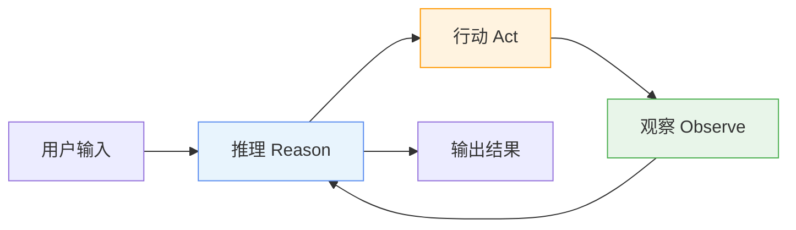
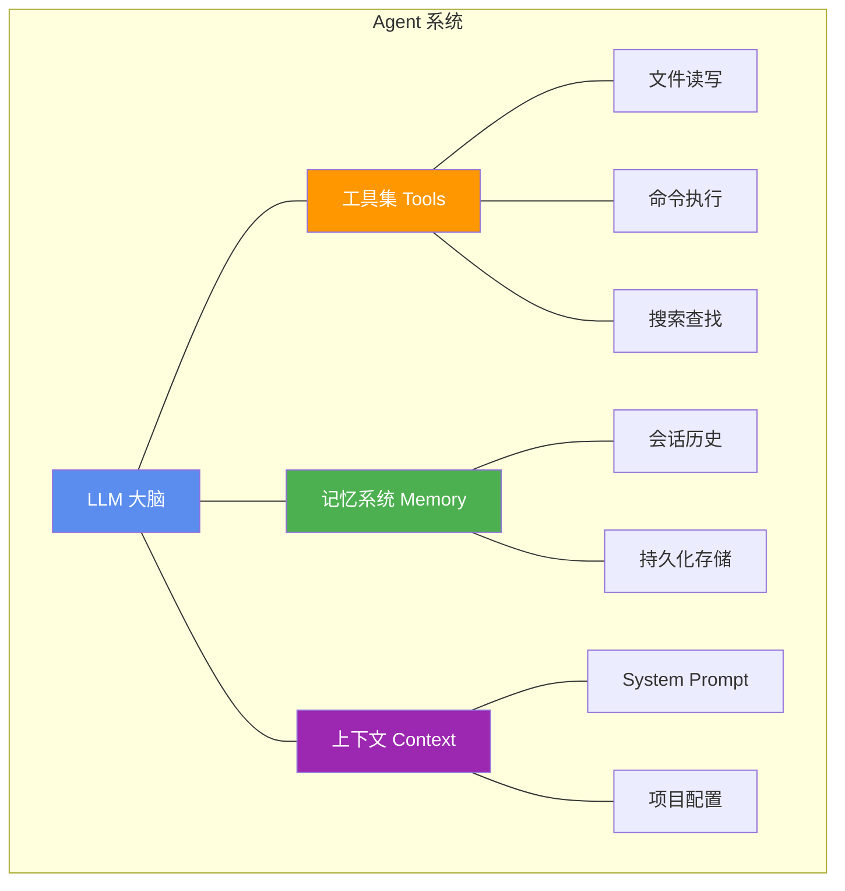

# Ch01 什么是 AI Agent

## 从聊天机器人到 Agent

你可能已经用过 ChatGPT、Claude 这类产品。它们本质上是**聊天机器人**：你问一句，它答一句，每次对话都是独立的"请求-响应"。

但 AI Agent 不一样。

**Agent 是一个能自主完成任务的系统。** 它不仅能回答问题，还能：

- 拆解复杂任务为多个步骤
- 决定下一步做什么
- 调用外部工具（读写文件、执行命令）
- 根据结果调整策略
- 在需要时停下来问你

::: tip 一句话区分
聊天机器人：你问"帮我写个排序函数"，它返回一段代码。
Agent：你问"帮我重构这个项目"，它先读代码、分析结构、制定计划、逐步修改、跑测试、修 bug，最后告诉你完成了。
:::

## Agent 的核心模式：ReAct

2022 年，Yao et al. 提出了 **ReAct**（Reasoning + Acting）模式，这是目前几乎所有 AI Agent 的基础架构：



这个循环的每一步做什么？

| 步骤 | 做什么 | 例子 |
|------|--------|------|
| **Reason** | LLM 思考当前状态，决定下一步 | "我需要先看看项目的目录结构" |
| **Act** | 调用一个工具执行操作 | 调用 `bash` 执行 `ls -la` |
| **Observe** | 获取工具返回的结果 | 看到目录下有 `src/`、`tests/` 等 |

这个循环一直持续，直到 LLM 认为任务完成，不再调用任何工具，直接输出最终回答。

## 一个具体的例子

假设用户说："把 src/utils.ts 里的所有 `var` 改成 `const`"。

Agent 的执行过程：

```
第 1 轮:
  [Reason] 我需要先看看这个文件的内容
  [Act]    调用 read("src/utils.ts")
  [Observe] 看到文件内容，发现第 3、7、12 行用了 var

第 2 轮:
  [Reason] 我需要把第 3 行的 var 改成 const
  [Act]    调用 edit("src/utils.ts", "var count = 0", "const count = 0")
  [Observe] 修改成功

第 3 轮:
  [Reason] 继续修改第 7 行
  [Act]    调用 edit("src/utils.ts", "var name = 'test'", "const name = 'test'")
  [Observe] 修改成功

第 4 轮:
  [Reason] 继续修改第 12 行
  [Act]    调用 edit("src/utils.ts", "var result = null", "const result = null")
  [Observe] 修改成功，所有 var 都改完了

第 5 轮:
  [Reason] 任务完成，不再需要调用工具
  [输出]   "已完成修改，共替换了 3 处 var 为 const"
```

## Agent 的关键组成部分

一个完整的 AI Agent 系统包含以下核心组件：



| 组件 | 作用 | Pi 的实现 |
|------|------|----------|
| **LLM 大脑** | 推理和决策 | 支持 15+ Provider，可中途切换模型 |
| **工具集** | 与外部世界交互 | 只有 4 个：read / write / edit / bash |
| **记忆系统** | 保持上下文连贯 | JSONL 树状会话 + 自动 Compaction |
| **上下文** | 提供任务背景 | AGENTS.md + Skills 按需加载 |

## 为什么工具设计很重要

Agent 的能力边界由它的工具集决定。这里有一个关键的设计抉择：

**方案 A：大而全的工具集**
```
tools: [read, write, edit, bash, grep, find, ls, git, npm, docker, 
        search, browse, email, slack, database, ...]
```

**方案 B：小而精的工具集**
```
tools: [read, write, edit, bash]  // Pi 的选择
```

::: warning 为什么 Pi 选择方案 B？
1. **bash 是万能胶水**：grep、find、ls、git、npm……所有命令行工具都可以通过 bash 调用
2. **更少的工具 = 更少的 token**：工具定义会占用上下文窗口，4 个工具的定义不到 1000 token
3. **LLM 天然会用 bash**：前沿模型在训练时已经见过海量 shell 脚本，不需要你教它怎么用 grep
4. **更简单的维护**：工具越少，出 bug 的地方越少
:::

## 和其他 Agent 框架的区别

你可能听说过 LangChain、AutoGen、CrewAI 等框架。它们和 Pi 有什么区别？

| 维度 | LangChain 等 | Pi |
|------|-------------|-----|
| **定位** | Agent 编程框架（SDK） | 终端编码 Agent（产品） |
| **使用方式** | 写代码调用 API | 直接在终端使用 |
| **工具数量** | 数百个集成 | 只有 4 个核心工具 |
| **扩展方式** | 代码级插件 | 扩展 + Skill + 包 |
| **抽象层级** | 高（Chain、Agent、Tool 等概念） | 低（直接暴露原语） |
| **适合场景** | 构建复杂多 Agent 系统 | 日常编码辅助 + 学习 Agent 原理 |

::: tip 关键洞察
Pi 不是 LangChain 的竞品，它们解决不同的问题。但 Pi 的设计哲学——"原语优先，不要过度抽象"——值得所有 Agent 开发者学习。
:::

## 本教程的路线图

我们不会直接读 Pi 的源码（那太复杂了），而是**从零开始，用渐进式 Demo 重建它的核心思想**：

```
Demo 01: Hello LLM         → 学会调用 LLM API
Demo 02: Tool Calling       → 理解 Function Calling 机制
Demo 03: Agent Loop         → 实现 ReAct 循环
Demo 04: Read/Write/Bash    → 实现 Pi 的四把手术刀
Demo 05: Multi Provider     → 统一多 Provider 抽象
Demo 06: Session & Memory   → JSONL 会话 + Compaction
Demo 07: Skill System       → 按需加载能力
Demo 08: Mini Agent         → 组装完整项目
```

## 小练习

::: details 练习 1：区分 Agent 和聊天机器人
判断以下场景，哪些需要 Agent，哪些用普通聊天机器人就够了？

1. 翻译一段英文
2. 帮我把这个 CSV 文件里的数据生成可视化图表
3. 帮我重构整个项目的错误处理
4. 解释一下什么是递归
5. 帮我部署这个项目到 AWS

::: details 查看答案
1. 聊天机器人（单轮翻译）
2. Agent（需要读文件、分析数据、生成代码、运行代码）
3. Agent（需要读多个文件、理解架构、逐步修改）
4. 聊天机器人（纯知识解释）
5. Agent（需要理解项目结构、配置环境、执行命令、处理错误）
:::
:::

::: details 练习 2：设计一个简单 Agent
假设你要构建一个"代码审查 Agent"，它需要哪些工具？画出它的 ReAct 循环。
::: details 参考思路
最少需要：read（读代码）、bash（运行测试/lint）

循环：
1. Reason：我需要审查这个 PR
2. Act：read 读取变更的文件
3. Observe：看到代码内容
4. Reason：这段代码有潜在的 NPE，让我运行一下 lint
5. Act：bash 执行 lint
6. Observe：发现 3 个警告
7. Reason：整理发现，输出审查报告
:::
:::

## 下一章

我们已经理解了 Agent 的基本概念。下一章，我们将深入 Pi 的设计哲学——为什么它选择"极简"而不是"大而全"，以及这个选择背后的技术考量。
