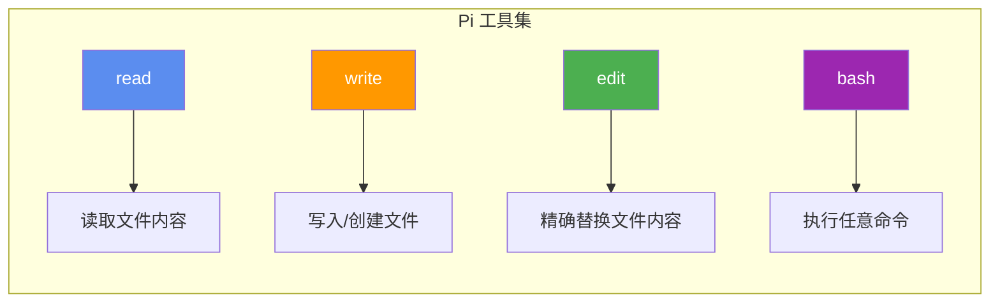
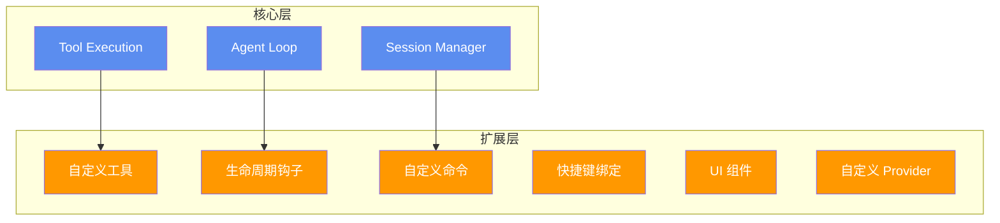
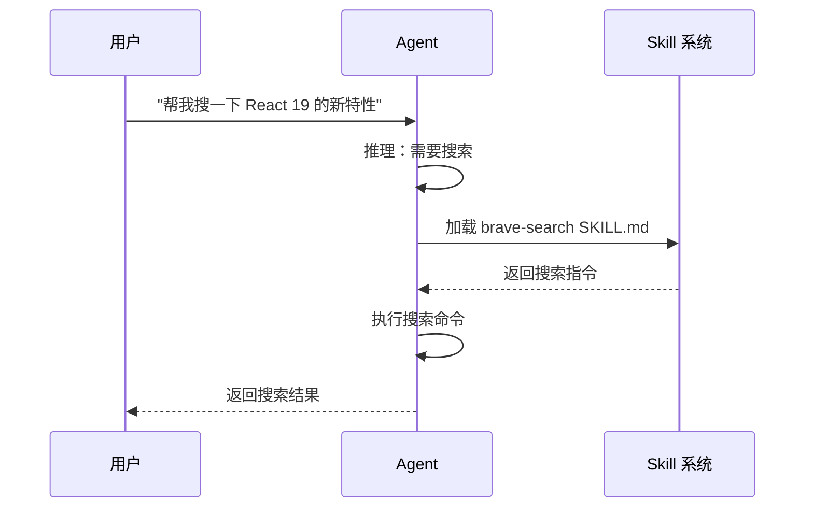
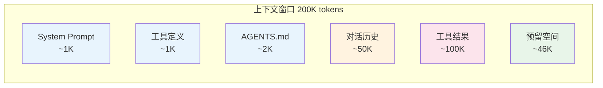
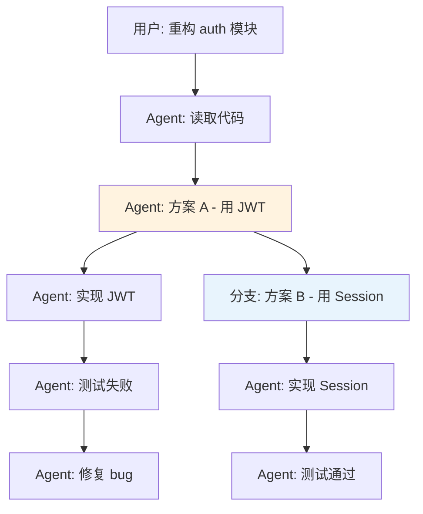

# Ch02 Pi 的设计哲学

## "Primitives, not features"

Pi 的核心哲学用一句话概括：**给用户原语（primitives），而不是功能（features）**。

这是什么意思？看看 Pi 和 Claude Code 的对比：

| 能力 | Claude Code | Pi |
|------|------------|-----|
| 子 Agent | 内置 | 你自己用扩展实现 |
| Plan Mode | 内置 | 你自己写 PLAN.md |
| Todo 列表 | 内置 | 你自己用 TODO.md |
| MCP 支持 | 内置 | 你自己用扩展实现 |
| 权限弹窗 | 内置 | 没有（YOLO 模式） |
| 后台任务 | 内置 | 用 tmux |

Pi 的创造者 Mario Zechner 说：

> Claude Code 像一艘飞船，80% 的功能我用不上。我想要的是一套积木，让我自己拼出需要的东西。

## 四把手术刀

Pi 的整个工具集只有 4 个工具：



为什么这 4 个就够了？

**read** —— Agent 需要了解现状
```
→ 读代码、读配置、读文档、读日志……
```

**write** —— Agent 需要创建新东西
```
→ 写新文件、写配置、写测试……
```

**edit** —— Agent 需要精确修改
```
→ 改代码、改配置、改变量名……（比 write 安全，不会覆盖整个文件）
```

**bash** —— Agent 需要和世界交互
```
→ 运行命令、安装依赖、跑测试、git 操作、grep 搜索……
bash 是万能胶水，几乎所有 CLI 工具都可以通过它调用
```

::: tip 为什么不需要单独的 grep/find/ls 工具？
Pi 最初有 7 个工具（包括 grep、find、ls），后来砍到了 4 个。原因是：
- `grep "pattern" file` 通过 bash 就能做
- `find . -name "*.ts"` 通过 bash 就能做
- `ls -la` 通过 bash 就能做
- 多 3 个工具 = 多 3 倍的工具定义 token 浪费
:::

## 工具定义的 Token 经济学

这是一个经常被忽略但极其重要的问题。每个工具的定义（名称 + 描述 + 参数 schema）都会占用上下文窗口。

```
Pi 的 4 个工具定义:     ~800 tokens
Claude Code 的工具定义:  ~4,000 tokens
LangChain 的工具集:      ~10,000+ tokens
```

为什么这很重要？

| 影响 | 说明 |
|------|------|
| **成本** | Token 越多，API 调用越贵 |
| **速度** | Token 越多，首 token 延迟越高 |
| **上下文空间** | 工具定义占的空间 = 你能放的代码/对话越少 |
| **注意力分散** | 工具越多，LLM 选错工具的概率越高 |

::: warning 一个反直觉的事实
Pi 的系统提示词约 1K token，4 个工具定义约 800 token，总计约 2K token，而 Claude Code 的超过 10,000 token。这意味着 Pi 每次调用都省了 8000 token 的上下文空间——这些空间可以用来放更多代码、更多对话历史。
:::

## 扩展：一切皆可插拔

Pi 的核心极简，但它通过**扩展系统**实现了几乎无限的可扩展性：



一个扩展长什么样？

```typescript
// .pi/extensions/my-extension.ts
export default function (pi) {
  // 监听生命周期事件
  pi.on("agent_start", async (event, ctx) => {
    console.log("Agent 启动了！")
  })

  // 注册自定义工具
  pi.registerTool({
    name: "web_search",
    description: "搜索网页",
    parameters: { query: { type: "string" } },
    execute: async (id, params) => {
      // 搜索逻辑...
      return { content: [{ type: "text", text: "搜索结果..." }] }
    }
  })

  // 注册斜杠命令
  pi.registerCommand("deploy", {
    description: "部署项目",
    execute: async (args, ctx) => {
      // 部署逻辑...
    }
  })
}
```

::: tip 关键设计
扩展不需要编译——Pi 用 [jiti](https://github.com/unjs/jiti) 直接加载 TypeScript 文件。这意味着你写完扩展，重启 Pi 就能用，零配置。
:::

## Skill：按需加载的能力

Skill 是 Pi 的另一个精妙设计。它解决了一个问题：**如何在不浪费上下文空间的情况下给 Agent 添加能力？**

传统做法：
```
System Prompt: 
  "你可以搜索网页，使用方法是..."
  "你可以处理 PDF，使用方法是..."
  "你可以操作浏览器，使用方法是..."
  // 所有能力的说明都塞在 system prompt 里，浪费 token
```

Pi 的做法：
```
System Prompt:
  "你有以下 Skill 可用（只放描述，不放详细说明）：
   - brave-search: 搜索网页
   - pdf-tools: 处理 PDF
   - browser: 操作浏览器"

当用户说"帮我搜一下 XX"时：
  → Agent 读取 brave-search 的 SKILL.md
  → 按需加载详细指令
  → 执行搜索
```



这就是**渐进式披露（Progressive Disclosure）**——只在需要时才加载详细信息。

## Context Engineering：上下文工程

Pi 团队认为，Agent 的质量很大程度上取决于**上下文的质量**。他们称之为 "Context Engineering"。

上下文窗口就像一个有限的工作台：



Pi 的上下文工程策略：

| 策略 | 做法 |
|------|------|
| **最小化 System Prompt** | 不到 1000 token，用户可以通过 SYSTEM.md 完全覆盖 |
| **最小化工具定义** | 4 个工具，定义精简到极致 |
| **按需加载 Skill** | 只加载描述，详细指令按需读取 |
| **层级配置** | AGENTS.md 在项目根目录，逐级向下加载 |
| **自动压缩** | 接近上下文上限时，自动总结历史对话 |

## YOLO 模式：为什么没有权限弹窗

Pi 默认是 **YOLO 模式**——Agent 有完整的文件系统访问权限，没有权限弹窗。

这看起来很疯狂，但 Pi 团队的理由是：

::: warning "权限弹窗是安全剧场"
1. Agent 能写文件、能执行 bash——它已经可以做任何事了
2. 权限弹窗只是让你"感觉"安全，实际上你不可能每次都仔细审查
3. 真正的安全保障应该是：沙箱环境 + git 版本控制 + 测试
4. 弹窗打断工作流，降低效率
:::

::: tip 如果你真的需要权限控制
Pi 的扩展系统支持注册权限钩子——你可以自己实现一个权限弹窗。但 Pi 团队建议你用更好的方案：在沙箱里运行 Agent。
:::

## 树状会话：不是线性的

大多数 Agent 的对话是线性的——从头到尾一条线。Pi 的对话是**树状**的：



你可以在任何节点创建分支，探索不同的方案，最后选择最好的那个。这比线性对话灵活得多。

## 小练习

::: details 练习 1：工具精简
假设你要设计一个"数据分析 Agent"，你会给它哪些工具？试着用 Pi 的哲学——最少的工具覆盖最多场景。

::: details 参考思路
最少方案：
1. `read` —— 读取数据文件
2. `write` —— 写入分析结果
3. `edit` —— 修改脚本
4. `bash` —— 运行 Python/R 脚本、安装包、调用 pandas 等

有了 bash，你不需要单独的 `pandas` 工具或 `matplotlib` 工具——Agent 可以通过 bash 运行 Python 脚本来使用这些库。
:::
:::

::: details 练习 2：Skill 设计
为上面的"数据分析 Agent"设计 3 个 Skill，写出它们的描述（description）。

::: details 参考思路
```yaml
---
name: csv-analysis
description: 分析 CSV 文件，生成统计摘要和可视化图表。支持 pandas 和 matplotlib。
---

---
name: sql-query
description: 连接数据库执行 SQL 查询，支持 PostgreSQL、MySQL、SQLite。
---

---
name: report-gen
description: 生成 PDF/HTML 格式的数据分析报告，包含图表和文字说明。
---
```
:::
:::

## 下一章

理解了 Pi 的设计哲学后，我们开始动手。下一章，我们将写出第一个 LLM API 调用——这是所有 Agent 的起点。
