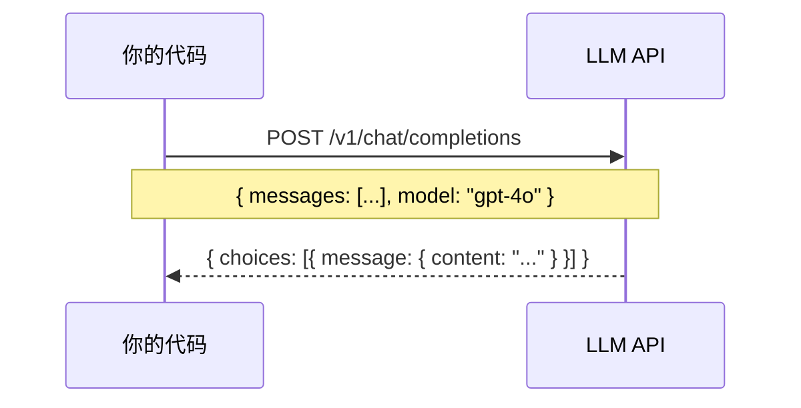
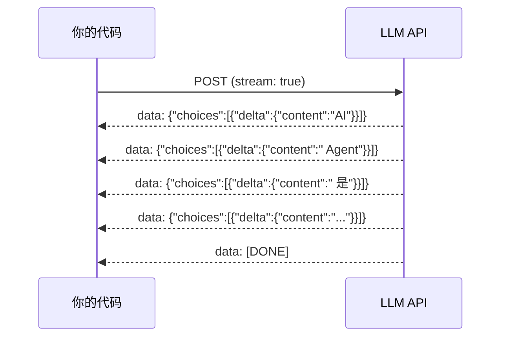

# Ch03 第一次 LLM 调用

## 从零开始：调用 LLM API

所有 Agent 的起点都是同一个动作：**向 LLM 发送一个请求，获取响应**。这章我们不依赖任何框架，直接用原生 HTTP 请求调用 LLM API。

## 选择 API

我们支持三种主流 Provider：

| Provider | API 格式 | 典型模型 |
|----------|---------|---------|
| OpenAI | Chat Completions | gpt-4o, gpt-4o-mini |
| Anthropic | Messages | claude-sonnet-4-20250514, claude-haiku-4-5-20251001 |
| Google | Generative AI | gemini-2.0-flash, gemini-2.5-pro |

它们的 API 格式略有不同，但核心概念一致：



## Demo 01：Hello LLM

让我们写第一个 LLM 调用。创建项目：

```bash
mkdir demo-01-hello-llm && cd demo-01-hello-llm
npm init -y
npm install typescript tsx @types/node
npx tsc --init
```

::: details 项目结构
```
demo-01-hello-llm/
├── src/
│   └── index.ts
├── package.json
└── tsconfig.json
```
:::

核心代码：

```typescript
// src/index.ts
const API_KEY = process.env.OPENAI_API_KEY!
const MODEL = "gpt-4o-mini"

interface ChatMessage {
  role: "system" | "user" | "assistant"
  content: string
}

async function chat(messages: ChatMessage[]): Promise<string> {
  const response = await fetch("https://api.openai.com/v1/chat/completions", {
    method: "POST",
    headers: {
      "Content-Type": "application/json",
      "Authorization": `Bearer ${API_KEY}`,
    },
    body: JSON.stringify({
      model: MODEL,
      messages,
    }),
  })

  const data = await response.json()
  return data.choices[0].message.content
}

// 运行
const messages: ChatMessage[] = [
  { role: "system", content: "你是一个有帮助的助手。" },
  { role: "user", content: "用一句话解释什么是 AI Agent" },
]

chat(messages).then(console.log)
```

运行：

```bash
OPENAI_API_KEY=sk-xxx npx tsx src/index.ts
```

::: tip 输出示例
AI Agent 是一个能自主推理、调用工具、并根据结果迭代执行的智能系统。
:::

## 加入流式响应

上面的代码是**非流式**的——必须等整个响应生成完才能看到。实际产品中，我们需要**流式（streaming）**响应：



实现流式调用：

```typescript
async function* chatStream(messages: ChatMessage[]): AsyncGenerator<string> {
  const response = await fetch("https://api.openai.com/v1/chat/completions", {
    method: "POST",
    headers: {
      "Content-Type": "application/json",
      "Authorization": `Bearer ${API_KEY}`,
    },
    body: JSON.stringify({
      model: MODEL,
      messages,
      stream: true,
    }),
  })

  const reader = response.body!.getReader()
  const decoder = new TextDecoder()
  let buffer = ""

  while (true) {
    const { done, value } = await reader.read()
    if (done) break

    buffer += decoder.decode(value, { stream: true })
    const lines = buffer.split("\n")
    buffer = lines.pop() || ""

    for (const line of lines) {
      if (!line.startsWith("data: ") || line === "data: [DONE]") continue
      const json = JSON.parse(line.slice(6))
      const content = json.choices[0]?.delta?.content
      if (content) yield content
    }
  }
}

// 使用
async function main() {
  const messages: ChatMessage[] = [
    { role: "user", content: "用三句话介绍 TypeScript" }
  ]
  
  for await (const chunk of chatStream(messages)) {
    process.stdout.write(chunk)  // 逐字输出
  }
  console.log()  // 换行
}

main()
```

## 统一多 Provider API

OpenAI、Anthropic、Google 的 API 格式不同。Pi 的做法是定义一个**统一接口**，然后为每个 Provider 写适配器：

```typescript
// 统一的 Provider 接口
interface Provider {
  name: string
  chat(messages: ChatMessage[], options?: ChatOptions): AsyncGenerator<string>
}

interface ChatOptions {
  model?: string
  temperature?: number
  maxTokens?: number
}

// OpenAI 适配器
class OpenAIProvider implements Provider {
  name = "openai"
  
  async *chat(messages: ChatMessage[], options?: ChatOptions): AsyncGenerator<string> {
    // ... 用 OpenAI API 格式调用
  }
}

// Anthropic 适配器
class AnthropicProvider implements Provider {
  name = "anthropic"
  
  async *chat(messages: ChatMessage[], options?: ChatOptions): AsyncGenerator<string> {
    // ... 用 Anthropic API 格式调用
  }
}
```

::: tip Pi 的做法
Pi 在 `@earendil-works/pi-ai` 包中实现了这个统一层，支持 15+ Provider。每个 Provider 只需实现一个适配器，就能无缝切换。
:::

## Anthropic API 的关键差异

Anthropic 的 Messages API 和 OpenAI 有几个重要区别：

| 特性 | OpenAI | Anthropic |
|------|--------|-----------|
| 系统提示 | `messages` 数组中 `role: "system"` | 单独的 `system` 字段 |
| API 路径 | `/v1/chat/completions` | `/v1/messages` |
| 响应格式 | `choices[0].message.content` | `content[0].text` |
| 流式格式 | SSE with `delta` | SSE with `content_block_delta` |

```typescript
// Anthropic 的调用方式
async function anthropicChat(messages: ChatMessage[], system?: string) {
  const response = await fetch("https://api.anthropic.com/v1/messages", {
    method: "POST",
    headers: {
      "Content-Type": "application/json",
      "x-api-key": ANTHROPIC_API_KEY,
      "anthropic-version": "2023-06-01",
    },
    body: JSON.stringify({
      model: "claude-sonnet-4-20250514",
      max_tokens: 1024,
      system,  // 系统提示单独传
      messages: messages.filter(m => m.role !== "system"),
    }),
  })

  const data = await response.json()
  return data.content[0].text
}
```

## 错误处理

真实的 API 调用会遇到各种错误：

```typescript
async function chatWithErrorHandling(messages: ChatMessage[]): Promise<string> {
  try {
    const response = await fetch("https://api.openai.com/v1/chat/completions", {
      method: "POST",
      headers: {
        "Content-Type": "application/json",
        "Authorization": `Bearer ${API_KEY}`,
      },
      body: JSON.stringify({ model: MODEL, messages }),
    })

    if (!response.ok) {
      const error = await response.json()
      
      // 常见错误处理
      switch (response.status) {
        case 401:
          throw new Error("API Key 无效，请检查 OPENAI_API_KEY")
        case 429:
          throw new Error("请求频率超限，请稍后重试")
        case 500:
          throw new Error("服务端错误，请稍后重试")
        default:
          throw new Error(`API 错误: ${error.error?.message || response.status}`)
      }
    }

    const data = await response.json()
    return data.choices[0].message.content
  } catch (err) {
    if (err instanceof TypeError && err.message.includes("fetch")) {
      throw new Error("网络连接失败，请检查网络")
    }
    throw err
  }
}
```

::: warning 上下文溢出错误
当对话历史超过模型的上下文窗口时，API 会返回 `context_length_exceeded` 错误。这是 Agent 必须处理的关键错误——后面的 Compaction 机制就是为了解决这个问题。
:::

## 小练习

::: details 练习 1：实现 Google Gemini 适配器
参考上面的 OpenAI 和 Anthropic 适配器，实现一个 Google Gemini 的适配器。Gemini 的 API 端点是 `https://generativelanguage.googleapis.com/v1beta/models/{model}:generateContent`。

::: details 提示
Gemini API 的请求格式：
```json
{
  "contents": [
    { "role": "user", "parts": [{ "text": "..." }] }
  ],
  "systemInstruction": {
    "parts": [{ "text": "..." }]
  }
}
```
:::
:::

::: details 练习 2：添加重试机制
为 `chatWithErrorHandling` 添加自动重试逻辑：遇到 429 和 500 错误时，等待 1 秒后重试，最多重试 3 次。

::: details 参考思路
```typescript
async function chatWithRetry(messages: ChatMessage[], maxRetries = 3) {
  for (let i = 0; i < maxRetries; i++) {
    try {
      return await chatWithErrorHandling(messages)
    } catch (err) {
      if (i === maxRetries - 1) throw err
      if (err.message.includes("频率超限") || err.message.includes("服务端")) {
        await new Promise(r => setTimeout(r, 1000 * (i + 1)))  // 指数退避
        continue
      }
      throw err
    }
  }
}
```
:::
:::

## 下一章

我们已经能调用 LLM 了。下一章，我们将实现 Agent 的核心——**Agent Loop**，让 LLM 不只是回答问题，而是能自主地推理、行动、观察。
