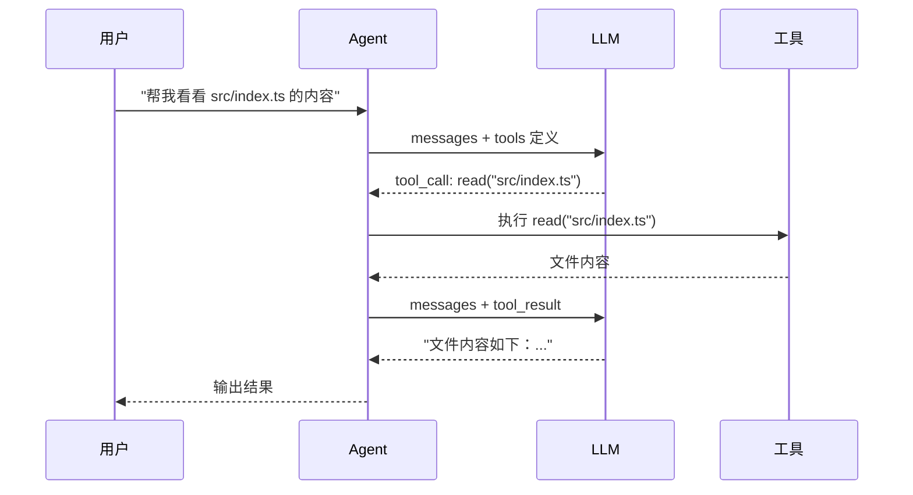

# Ch04 Agent Loop：核心循环

## 从"一次性回答"到"自主循环"

上一章我们实现了 LLM 调用——问一句答一句。但这不是 Agent。Agent 的核心是一个**循环**：推理 → 行动 → 观察 → 再推理 → 再行动……直到任务完成。

这一章，我们将实现这个循环。

## 运行前置条件

在开始本章之前，请确保满足以下条件：

1. **Node.js 18+**：原生支持 `fetch` API
2. **OpenAI API Key**：本章示例使用 OpenAI 的 Function Calling 功能
3. **环境变量**：设置 `OPENAI_API_KEY`

```bash
# 检查 Node.js 版本
node --version

# 设置 API Key
export OPENAI_API_KEY=sk-xxx
```

## Function Calling：让 LLM 调用工具

在实现 Agent Loop 之前，我们需要理解 **Function Calling**（函数调用）机制。这是 OpenAI 在 2023 年引入的能力，让 LLM 不只是生成文本，还能**请求调用函数**。



关键点：LLM **不会直接执行工具**，它只是输出一个"我想调用这个函数"的请求。**Agent 负责真正执行**。

## 工具定义格式

告诉 LLM 有哪些工具可用，需要提供工具的 JSON Schema：

```typescript
const tools = [
  {
    type: "function",
    function: {
      name: "read",
      description: "读取文件内容",
      parameters: {
        type: "object",
        properties: {
          path: {
            type: "string",
            description: "文件路径"
          }
        },
        required: ["path"]
      }
    }
  },
  {
    type: "function",
    function: {
      name: "bash",
      description: "执行 shell 命令",
      parameters: {
        type: "object",
        properties: {
          command: {
            type: "string",
            description: "要执行的命令"
          }
        },
        required: ["command"]
      }
    }
  }
]
```

LLM 看到这些定义后，当它决定要读文件时，会返回：

```json
{
  "role": "assistant",
  "content": null,
  "tool_calls": [
    {
      "id": "call_abc123",
      "type": "function",
      "function": {
        "name": "read",
        "arguments": "{\"path\": \"src/index.ts\"}"
      }
    }
  ]
}
```

## Agent Loop 的核心逻辑

这是整个教程最关键的部分。Pi 的 Agent Loop 本质上就是：

```
while (true) {
    response = callLLM(messages, tools)
    
    if (response has tool_calls) {
        // LLM 想调用工具
        for each tool_call {
            result = executeTool(tool_call)
            messages.append(tool_result)
        }
        // 继续循环，让 LLM 看到工具结果
    } else {
        // LLM 不再调用工具，输出最终回答
        break
    }
}
```

::: tip 为什么循环而不是递归？
Pi 用的是循环而不是递归调用 LLM。原因：
1. 循环更容易控制（不会栈溢出）
2. 状态管理更清晰（messages 数组是唯一的状态）
3. 更容易中断（检查 abort signal）
:::

## Demo 03：实现 Agent Loop

完整实现：

```typescript
// src/agent-loop.ts

interface Message {
  role: "system" | "user" | "assistant" | "tool"
  content: string | null
  tool_calls?: ToolCall[]
  tool_call_id?: string
}

interface ToolCall {
  id: string
  type: "function"
  function: {
    name: string
    arguments: string
  }
}

interface Tool {
  name: string
  description: string
  parameters: object
  execute: (toolCallId: string, args: Record<string, any>) => Promise<string>
}

// 工具注册表
const toolRegistry = new Map<string, Tool>()

function registerTool(tool: Tool) {
  toolRegistry.set(tool.name, tool)
}

// 调用 LLM（带工具定义）
async function callLLM(messages: Message[]): Promise<Message> {
  const response = await fetch("https://api.openai.com/v1/chat/completions", {
    method: "POST",
    headers: {
      "Content-Type": "application/json",
      "Authorization": `Bearer ${process.env.OPENAI_API_KEY}`,
    },
    body: JSON.stringify({
      model: "gpt-4o",
      messages,
      tools: Array.from(toolRegistry.values()).map(tool => ({
        type: "function",
        function: {
          name: tool.name,
          description: tool.description,
          parameters: tool.parameters,
        }
      })),
    }),
  })

  const data = await response.json()
  return data.choices[0].message
}

// 执行工具
async function executeTool(toolCall: ToolCall): Promise<string> {
  const tool = toolRegistry.get(toolCall.function.name)
  if (!tool) return `错误：未知工具 ${toolCall.function.name}`

  try {
    const args = JSON.parse(toolCall.function.arguments)
    return await tool.execute(toolCall.id, args)
  } catch (err) {
    return `工具执行错误: ${err.message}`
  }
}

// ===== Agent Loop =====
async function agentLoop(messages: Message[]): Promise<string> {
  const MAX_ITERATIONS = 20  // 安全阀，防止无限循环
  let iterations = 0

  while (iterations < MAX_ITERATIONS) {
    iterations++
    console.log(`\n--- 第 ${iterations} 轮 ---`)

    const response = await callLLM(messages)
    messages.push(response)

    // 检查是否有工具调用
    if (response.tool_calls && response.tool_calls.length > 0) {
      console.log(`Agent 调用了 ${response.tool_calls.length} 个工具`)

      for (const toolCall of response.tool_calls) {
        console.log(`  → ${toolCall.function.name}(${toolCall.function.arguments})`)
        
        const result = await executeTool(toolCall)
        console.log(`  ← 结果: ${result.slice(0, 100)}...`)

        // 把工具结果加入消息历史
        messages.push({
          role: "tool",
          content: result,
          tool_call_id: toolCall.id,
        })
      }
      // 继续循环，让 LLM 看到工具结果
    } else {
      // 没有工具调用，任务完成
      console.log("\nAgent 完成任务")
      return response.content || ""
    }
  }

  return "达到最大迭代次数，停止执行"
}
```

## 一个完整的例子

让我们注册几个工具，然后运行 Agent Loop：

```typescript
// 注册工具
registerTool({
  name: "read",
  description: "读取文件内容",
  parameters: {
    type: "object",
    properties: {
      path: { type: "string", description: "文件路径" }
    },
    required: ["path"]
  },
  execute: async (_toolCallId, args) => {
    const fs = await import("fs/promises")
    try {
      return await fs.readFile(args.path, "utf-8")
    } catch {
      return `错误：文件 ${args.path} 不存在`
    }
  }
})

registerTool({
  name: "bash",
  description: "执行 shell 命令",
  parameters: {
    type: "object",
    properties: {
      command: { type: "string", description: "要执行的命令" }
    },
    required: ["command"]
  },
  execute: async (_toolCallId, args) => {
    const { execSync } = await import("child_process")
    try {
      return execSync(args.command, { encoding: "utf-8", timeout: 30000 })
    } catch (err) {
      return `命令执行失败: ${err.message}`
    }
  }
})

// 运行
async function main() {
  const messages: Message[] = [
    { role: "system", content: "你是一个编码助手，可以读取文件和执行命令。" },
    { role: "user", content: "当前目录下有哪些 TypeScript 文件？读一下 package.json 看看项目信息。" },
  ]

  const result = await agentLoop(messages)
  console.log("\n最终回答:", result)
}

main()
```

::: details 运行输出示例
```
--- 第 1 轮 ---
Agent 调用了 2 个工具
  → bash({"command": "find . -name '*.ts' -not -path './node_modules/*'"})
  ← 结果: ./src/index.ts\n./src/agent-loop.ts...
  → read({"path": "package.json"})
  ← 结果: {"name": "demo-03", "version": "1.0.0"...

--- 第 2 轮 ---
Agent 完成任务

最终回答: 当前目录下有 2 个 TypeScript 文件：
- ./src/index.ts
- ./src/agent-loop.ts

项目信息：
- 名称：demo-03
- 版本：1.0.0
...
```
:::

## Agent Loop 的关键设计决策

### 1. 什么时候停止？

LLM 不再返回 `tool_calls` 时停止。这是最自然的信号——LLM 认为它已经获取了足够信息，可以给出最终回答了。

### 2. 最大迭代次数

需要一个安全阀防止无限循环。Pi 默认不设上限（相信 LLM），但教学版建议设 20-50 次。

### 3. 工具结果怎么返回？

工具结果作为 `role: "tool"` 的消息加入历史。这和用户消息、助手消息一样，都是 LLM 的输入。

### 4. 多个工具调用是串行还是并行？

LLM 可以在一次响应中返回多个 `tool_calls`。Pi 选择**串行执行**（一个接一个），因为：
- 某些工具可能有依赖关系
- 并行执行会增加错误处理的复杂度
- 串行更可预测、更容易调试

```mermaid
graph LR
    LLM -->|tool_calls: [read, bash]| Agent
    Agent -->|先执行| T1[read]
    T1 -->|完成| T2[bash]
    T2 -->|结果| Agent
    Agent -->|tool_results| LLM
    
    style LLM fill:#5b8def,color:#fff
    style Agent fill:#ff9800,color:#fff
```

## 流式 Agent Loop

上面的实现是非流式的——每轮都要等 LLM 完整响应。实际产品中，我们需要流式输出，让用户能实时看到 Agent 的思考过程。

关键变化：

```typescript
async function* agentLoopStream(messages: Message[]): AsyncGenerator<AgentEvent> {
  while (true) {
    // 流式调用 LLM
    let fullContent = ""
    let toolCalls: ToolCall[] = []

    for await (const event of streamLLM(messages)) {
      if (event.type === "text") {
        fullContent += event.content
        yield { type: "text", content: event.content }  // 实时输出文本
      }
      if (event.type === "tool_call") {
        toolCalls.push(event.toolCall)
      }
    }

    // 构造 assistant 消息
    const assistantMessage: Message = {
      role: "assistant",
      content: fullContent || null,
      tool_calls: toolCalls.length > 0 ? toolCalls : undefined,
    }
    messages.push(assistantMessage)

    if (toolCalls.length > 0) {
      for (const toolCall of toolCalls) {
        yield { type: "tool_start", tool: toolCall.function.name }
        const result = await executeTool(toolCall)
        yield { type: "tool_result", result }
        messages.push({
          role: "tool",
          content: result,
          tool_call_id: toolCall.id,
        })
      }
    } else {
      yield { type: "done" }
      break
    }
  }
}

type AgentEvent =
  | { type: "text"; content: string }
  | { type: "tool_start"; tool: string }
  | { type: "tool_result"; result: string }
  | { type: "done" }
```

## 和 Pi 的真实实现对比

我们上面的实现已经捕获了 Pi Agent Loop 的核心思想。简化了什么？

| 方面 | 我们的教学版 | Pi 的真实实现 |
|------|------------|-------------|
| 工具执行 | 直接调用 | 通过生命周期钩子，扩展可以拦截 |
| 错误处理 | try-catch | 多层重试 + 自动恢复 |
| 流式输出 | 简单 generator | 差分渲染 + 同步输出（避免闪烁） |
| 中断支持 | 没有 | AbortSignal + steering message |
| 会话持久化 | 没有 | JSONL 树状存储 |
| 多 Provider | 只有 OpenAI | 15+ Provider 统一抽象 |

但核心逻辑是一样的：**循环调用 LLM，执行工具，把结果喂回去，直到 LLM 说"我做完了"**。

## 小练习

::: details 练习 1：添加最大迭代次数限制
修改 `agentLoop`，当达到最大迭代次数时，让 LLM 总结一下目前的进展，而不是直接返回错误信息。

::: details 参考思路
```typescript
if (iterations >= MAX_ITERATIONS) {
  messages.push({
    role: "user",
    content: "你已经执行了很多步，请总结一下目前的进展和遇到的问题。"
  })
  const summary = await callLLM(messages)
  return summary.content || "无法总结"
}
```
:::
:::

::: details 练习 2：添加工具调用日志
为 Agent Loop 添加一个事件系统，让外部代码可以监听工具调用的开始和结束。

::: details 参考思路
```typescript
type AgentEventListener = (event: AgentEvent) => void

class AgentLoop {
  private listeners: AgentEventListener[] = []
  
  on(listener: AgentEventListener) {
    this.listeners.push(listener)
  }
  
  private emit(event: AgentEvent) {
    this.listeners.forEach(l => l(event))
  }
  
  async run(messages: Message[]) {
    // ... 在工具执行前后调用 this.emit(...)
  }
}
```
:::
:::

## 下一章

我们已经实现了 Agent 的核心循环。但目前只有 2 个工具（read 和 bash）。下一章，我们将实现 Pi 的完整四工具集，并深入理解工具系统的设计。
