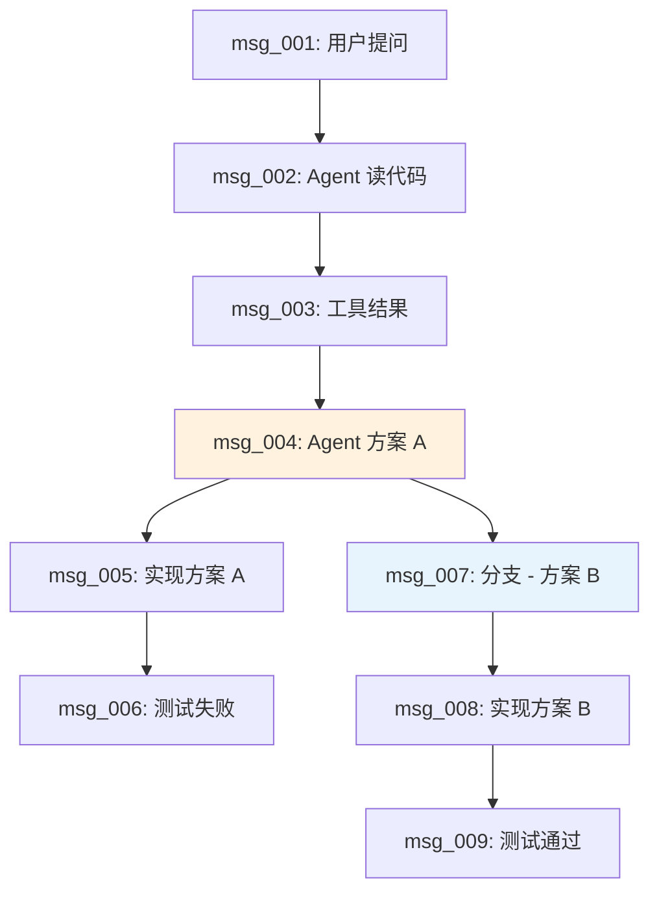
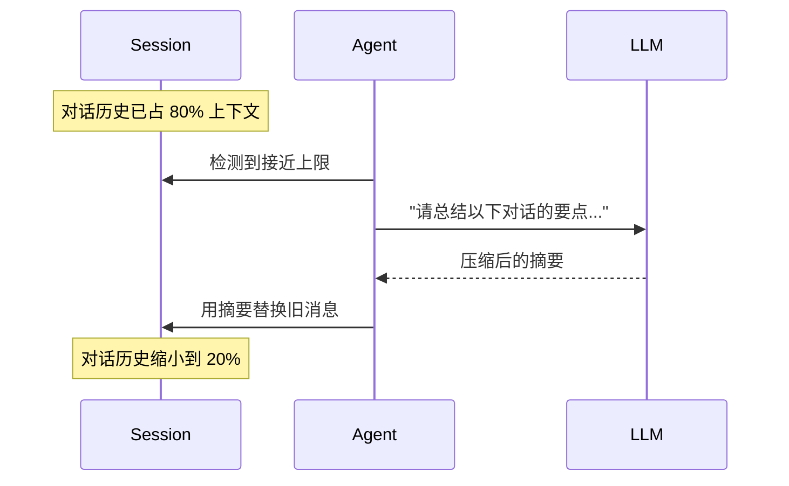

# Ch07 会话与记忆系统

## 为什么需要会话管理？

Agent 的对话历史就是它的"记忆"。但对话历史会不断增长，最终超过模型的上下文窗口。我们需要：

1. **持久化**：对话历史保存到磁盘，关闭后能恢复
2. **树状结构**：支持分支，探索不同方案
3. **自动压缩**：上下文快满时，自动总结旧对话

## 运行前置条件

在开始本章之前，请确保满足以下条件：

1. **Node.js 18+**：原生支持 `fetch` API
2. **OpenAI API Key**：本章示例使用 OpenAI 的 API 进行 Compaction
3. **环境变量**：设置 `OPENAI_API_KEY`

```bash
# 检查 Node.js 版本
node --version

# 设置 API Key
export OPENAI_API_KEY=sk-xxx
```

## JSONL 会话存储

Pi 用 JSONL（JSON Lines）格式存储会话。每条消息是一行 JSON：

```jsonl
{"id":"msg_001","parentId":null,"role":"user","content":"帮我重构 auth 模块","timestamp":1716900000000}
{"id":"msg_002","parentId":"msg_001","role":"assistant","content":"我来看看代码...","toolCalls":[...],"timestamp":1716900001000}
{"id":"msg_003","parentId":"msg_002","role":"tool","content":"文件内容...","toolCallId":"call_001","timestamp":1716900002000}
{"id":"msg_004","parentId":"msg_003","role":"assistant","content":"代码结构如下...","timestamp":1716900003000}
```

::: tip 为什么用 JSONL 而不是 JSON？
1. **追加友好**：每条新消息追加到文件末尾，不需要重写整个文件
2. **流式友好**：可以边写边读
3. **崩溃安全**：即使中途崩溃，已写入的消息不会丢失
:::

## 树状会话结构

通过 `id` 和 `parentId`，会话形成一棵树：



## 实现 SessionManager

```typescript
// session.ts
import { readFileSync, writeFileSync, existsSync, appendFileSync } from "fs"

interface ToolCall {
  id: string
  type: "function"
  function: {
    name: string
    arguments: string
  }
}

interface SessionEntry {
  id: string
  parentId: string | null
  role: "system" | "user" | "assistant" | "tool"
  content: string | null
  toolCalls?: ToolCall[]
  toolCallId?: string
  timestamp: number
}

class SessionManager {
  private entries: SessionEntry[] = []
  private currentLeafId: string | null = null
  private filePath: string

  constructor(filePath: string) {
    this.filePath = filePath
    if (existsSync(filePath)) {
      this.load()
    }
  }

  // 加载会话
  private load() {
    const content = readFileSync(this.filePath, "utf-8")
    this.entries = content
      .split("\n")
      .filter(line => line.trim())
      .map(line => JSON.parse(line))
    
    // 找到当前叶子节点（最后一条消息）
    if (this.entries.length > 0) {
      this.currentLeafId = this.entries[this.entries.length - 1].id
    }
  }

  // 添加消息
  append(entry: Omit<SessionEntry, "id" | "parentId" | "timestamp">): SessionEntry {
    const newEntry: SessionEntry = {
      ...entry,
      id: `msg_${Date.now()}_${Math.random().toString(36).slice(2, 8)}`,
      parentId: this.currentLeafId,
      timestamp: Date.now(),
    }

    this.entries.push(newEntry)
    this.currentLeafId = newEntry.id

    // 追加到文件
    appendFileSync(this.filePath, JSON.stringify(newEntry) + "\n")

    return newEntry
  }

  // 获取从根到当前叶子的路径
  getPath(): SessionEntry[] {
    const path: SessionEntry[] = []
    let currentId = this.currentLeafId

    while (currentId) {
      const entry = this.entries.find(e => e.id === currentId)
      if (!entry) break
      path.unshift(entry)
      currentId = entry.parentId
    }

    return path
  }

  // 获取完整树结构
  getTree(): SessionEntry[] {
    return this.entries
  }

  // 分支：回到某个节点，开始新分支
  branch(entryId: string) {
    const entry = this.entries.find(e => e.id === entryId)
    if (!entry) throw new Error(`找不到消息: ${entryId}`)
    this.currentLeafId = entryId
  }

  // 转换为 LLM 消息格式
  toMessages(): Message[] {
    return this.getPath().map(entry => ({
      role: entry.role,
      content: entry.content,
      toolCalls: entry.toolCalls,
      toolCallId: entry.toolCallId,
    }))
  }
}
```

## Compaction：上下文压缩

当对话历史接近上下文窗口上限时，我们需要**压缩**旧的历史。Pi 的做法是用 LLM 自己来总结：



实现 Compaction：

```typescript
class CompactionManager {
  constructor(
    private provider: Provider,
    private model: string,
  ) {}

  // 计算消息的 token 数（简化版）
  estimateTokens(messages: Message[]): number {
    // 粗略估计：1 个中文字符 ≈ 2 tokens，1 个英文单词 ≈ 1.3 tokens
    const text = messages.map(m => m.content || "").join("")
    return Math.ceil(text.length * 1.5)
  }

  // 检查是否需要压缩
  needsCompaction(messages: Message[], contextWindow: number): boolean {
    const usedTokens = this.estimateTokens(messages)
    return usedTokens > contextWindow * 0.75  // 超过 75% 就压缩
  }

  // 执行压缩
  async compact(messages: Message[], keepRecent: number = 5): Promise<Message[]> {
    // 保留最近的 N 条消息
    const recent = messages.slice(-keepRecent)
    const toSummarize = messages.slice(0, -keepRecent)

    if (toSummarize.length === 0) return messages

    // 让 LLM 总结
    const summaryRequest: ChatRequest = {
      model: this.model,
      messages: [{
        role: "user",
        content: `请将以下对话历史压缩为简洁的摘要，保留关键信息、决策和代码变更。只输出摘要，不要添加额外说明。\n\n${JSON.stringify(toSummarize.map(m => ({ role: m.role, content: m.content })))}`
      }],
    }

    const response = await this.provider.chat(summaryRequest)

    // 用摘要替换旧消息
    const compacted: Message[] = [
      { role: "system", content: `[对话摘要]\n${response.content}` },
      ...recent,
    ]

    console.log(`Compaction 完成：${messages.length} 条消息 → ${compacted.length} 条消息`)

    return compacted
  }
}
```

::: warning Compaction 的代价
压缩是有损的——一些细节会丢失。Pi 的策略是：
1. **保留最近的消息**：最近的对话最重要
2. **保留工具结果**：工具调用的结果可能包含关键信息
3. **只在必要时压缩**：不到 75% 不压缩
:::

## 集成到 Agent Loop

```typescript
class AgentLoop {
  private session: SessionManager
  private compaction: CompactionManager

  async run(userMessage: string): Promise<string> {
    // 添加用户消息
    this.session.append({ role: "user", content: userMessage })

    // 获取当前路径
    let messages = this.session.toMessages()

    // 检查是否需要压缩
    if (this.compaction.needsCompaction(messages, 128000)) {
      messages = await this.compaction.compact(messages)
      // 注意：压缩后的消息不写入 session，只用于当前轮次
    }

    // Agent Loop
    while (true) {
      const response = await this.provider.chat({
        model: this.model,
        messages,
        tools: this.tools,
      })

      // 保存 assistant 消息
      this.session.append({
        role: "assistant",
        content: response.content,
        toolCalls: response.toolCalls,
      })
      messages.push(response)

      if (response.toolCalls.length > 0) {
        for (const toolCall of response.toolCalls) {
          const result = await this.executeTool(toolCall)
          this.session.append({
            role: "tool",
            content: result,
            toolCallId: toolCall.id,
          })
          messages.push({
            role: "tool",
            content: result,
            toolCallId: toolCall.id,
          })
        }
      } else {
        return response.content || ""
      }
    }
  }
}
```

## 会话目录结构

Pi 的会话按项目目录组织：

```
~/.pi/agent/sessions/
├── Users-bobby-Projects-my-app/
│   ├── session_2025-01-15.jsonl
│   ├── session_2025-01-16.jsonl
│   └── session_2025-01-16_refactor-auth.jsonl  // 命名的会话
├── Users-bobby-Projects-another-app/
│   └── session_2025-01-15.jsonl
```

::: tip 会话命名
Pi 支持用 `/name` 命令给会话命名，方便后续查找。比如 `/name refactor-auth`。
:::

## 小练习

::: details 练习 1：实现会话分支
修改 SessionManager，实现 `/tree` 命令：列出所有分支，让用户选择回到哪个节点。

::: details 参考思路
```typescript
// 找到所有分支点（有多个子节点的节点）
getBranchPoints(): SessionEntry[] {
  const childCounts = new Map<string, number>()
  for (const entry of this.entries) {
    if (entry.parentId) {
      childCounts.set(entry.parentId, (childCounts.get(entry.parentId) || 0) + 1)
    }
  }
  return this.entries.filter(e => (childCounts.get(e.id) || 0) > 1)
}
```
:::
:::

::: details 练习 2：改进 Compaction 策略
当前的 Compaction 会丢失工具调用的结果。改进策略：保留工具调用的摘要，但丢弃完整的工具输出。

::: details 提示
在总结时，让 LLM 特别关注工具调用的结论，而不是原始输出。
:::
:::

## 下一章

会话和记忆系统搞定了。下一章，我们将深入上下文工程——如何精确控制进入 LLM 上下文窗口的内容。
