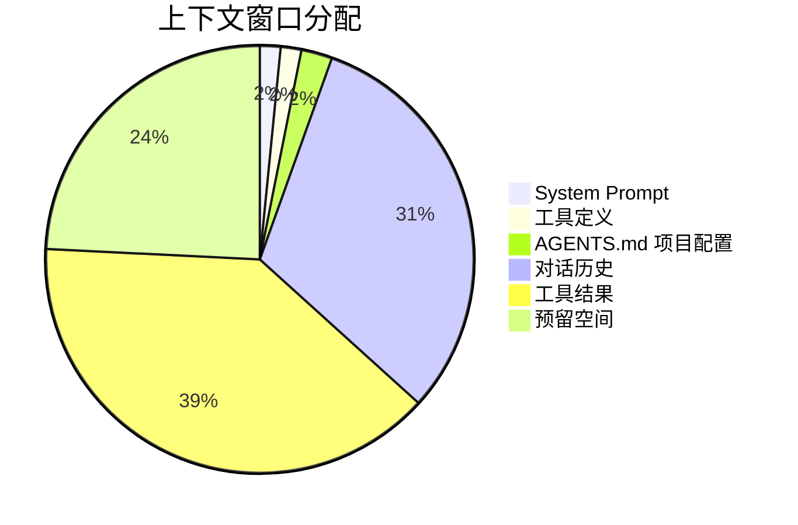
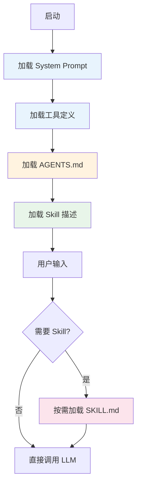
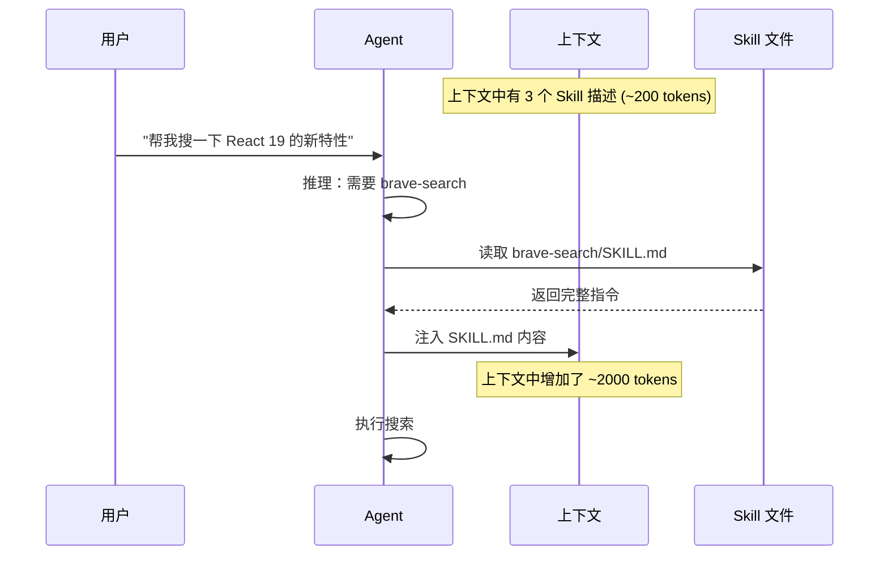
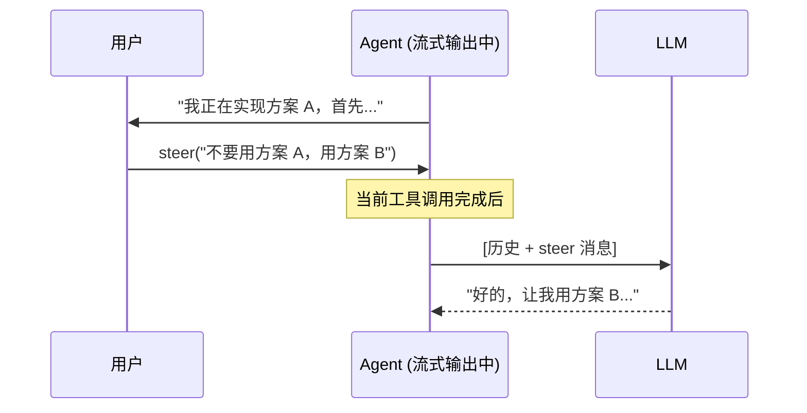

# Ch08 上下文工程

## 什么是上下文工程？

上下文工程（Context Engineering）是 Pi 团队提出的核心理念：**Agent 的质量取决于你喂给 LLM 的上下文质量**。

上下文窗口就像一个有限的工作台（以 GPT-4o 128K 为例）：



每一块内容都挤占其他内容的空间。上下文工程的目标是：**用最少的 token 传递最多的信息**。

## 上下文的层级结构

Pi 的上下文是分层加载的：



| 层级 | 内容 | Token 预算 | 加载时机 |
|------|------|-----------|---------|
| L1 | System Prompt | ~1K | 每次启动 |
| L2 | 工具定义 | ~1K | 每次启动 |
| L3 | AGENTS.md | ~2K | 每次启动 |
| L4 | Skill 描述 | ~500 | 每次启动（只加载描述） |
| L5 | SKILL.md 完整内容 | ~2K | 按需加载 |
| L6 | 对话历史 | 动态 | 累积增长 |
| L7 | 工具结果 | 动态 | 每次工具调用 |

## System Prompt 设计

Pi 的 System Prompt 极简，不到 1000 token：

```
You are a coding agent. You can read, write, edit files and execute bash commands.

When given a task:
1. Understand what the user wants
2. Read relevant files to understand the current state
3. Make changes using edit (for modifications) or write (for new files)
4. Use bash to run commands, install packages, or verify changes
5. When the task is complete, summarize what you did

Be concise. Do not explain what you're about to do - just do it.
```

::: tip 为什么这么短？
1. **节省 token**：每个 API 调用都会发送 system prompt
2. **减少干扰**：指令越多，LLM 越容易"走神"
3. **用户可定制**：通过 SYSTEM.md 完全覆盖
:::

## AGENTS.md：项目级配置

AGENTS.md 放在项目根目录，告诉 Agent 这个项目的信息：

```markdown
# 项目信息

这是一个 Next.js 14 项目，使用 App Router。

## 技术栈
- TypeScript strict mode
- Tailwind CSS
- Prisma + PostgreSQL
- NextAuth.js

## 代码规范
- 使用函数式组件
- 错误处理用 try-catch，不用 .catch()
- 测试用 Vitest，不用 Jest

## 常用命令
- `npm run dev` - 启动开发服务器
- `npm run test` - 运行测试
- `npm run lint` - 运行 ESLint

## 项目结构
- `src/app/` - App Router 页面
- `src/components/` - 可复用组件
- `src/lib/` - 工具函数和配置
- `prisma/` - 数据库 Schema
```

::: tip 层级加载
Pi 支持 AGENTS.md 的层级加载：
- `~/AGENTS.md` —— 全局配置（所有项目共享）
- `项目根目录/AGENTS.md` —— 项目配置
- `项目根目录/src/AGENTS.md` —— 子目录配置

子目录的配置会追加到父目录的配置后面。
:::

## Skill 的渐进式披露

Skill 是上下文工程最精妙的设计。它解决了一个两难问题：

**问题**：你想给 Agent 很多能力，但每多一个能力就多一堆 token。

**方案**：只在 System Prompt 里放 Skill 的描述（1-2 行），详细指令按需加载。

```typescript
// Skill 描述（始终在上下文中）
const skillDescriptions = [
  { name: "brave-search", description: "通过 Brave Search API 搜索网页" },
  { name: "pdf-tools", description: "处理 PDF 文件：提取文本、填写表单、合并拆分" },
  { name: "browser", description: "自动化浏览器操作：截图、点击、填表" },
]
// 总共约 200 token

// Skill 完整内容（按需加载）
// brave-search 的 SKILL.md 可能有 2000 token
// 只有当用户说"帮我搜一下"时才加载
```



## 上下文压缩策略

当对话历史增长时，需要压缩。Pi 的策略分几层：

### 1. 工具输出截断

```typescript
// 工具返回时就截断
function truncateToolOutput(output: string): string {
  const MAX_CHARS = 50000
  const MAX_LINES = 2000
  
  if (output.length > MAX_CHARS) {
    return output.slice(0, MAX_CHARS) + "\n... (已截断)"
  }
  
  const lines = output.split("\n")
  if (lines.length > MAX_LINES) {
    return lines.slice(0, MAX_LINES).join("\n") + "\n... (已截断)"
  }
  
  return output
}
```

### 2. 自动 Compaction

当总 token 数超过阈值时，自动触发 Compaction（上一章已实现）。

### 3. 分支摘要

当用户通过 `/tree` 切换到另一个分支时，Pi 会为离开的分支生成摘要：

```typescript
async function generateBranchSummary(messages: Message[]): Promise<string> {
  const response = await provider.chat({
    model,
    messages: [{
      role: "user",
      content: `请用 2-3 句话总结这段对话的关键信息：\n${messages.map(m => `${m.role}: ${m.content}`).join("\n")}`
    }],
  })
  return response.content || ""
}
```

## Steering 和 Follow-up

Pi 有两个精巧的消息注入机制：

### Steering Message（引导消息）

在 Agent 正在流式输出时，你可以插入一条引导消息，告诉它调整方向：



### Follow-up Message（后续消息）

当 Agent 完成任务停下来后，自动发送一条后续消息：

```typescript
// 用户说："帮我写个函数"
// Agent 写完了，停下来了
// Follow-up 消息自动触发："现在请为这个函数写测试"
```

## 实现上下文管理器

```typescript
class ContextManager {
  private systemPrompt: string
  private agentsMd: string
  private skillDescriptions: SkillDesc[]
  private loadedSkills: Map<string, string> = new Map()

  constructor(config: ContextConfig) {
    this.systemPrompt = config.systemPrompt
    this.agentsMd = config.agentsMd
    this.skillDescriptions = config.skillDescriptions
  }

  // 构建初始上下文
  buildInitialContext(): Message[] {
    const messages: Message[] = []

    // System Prompt
    messages.push({ role: "system", content: this.systemPrompt })

    // AGENTS.md
    if (this.agentsMd) {
      messages.push({ role: "system", content: `[项目配置]\n${this.agentsMd}` })
    }

    // Skill 描述
    if (this.skillDescriptions.length > 0) {
      const desc = this.skillDescriptions
        .map(s => `- ${s.name}: ${s.description}`)
        .join("\n")
      messages.push({ role: "system", content: `[可用 Skill]\n${desc}` })
    }

    return messages
  }

  // 按需加载 Skill
  async loadSkill(name: string): Promise<string> {
    if (this.loadedSkills.has(name)) {
      return this.loadedSkills.get(name)!
    }

    const skillPath = `.pi/skills/${name}/SKILL.md`
    const content = await readFile(skillPath, "utf-8")
    this.loadedSkills.set(name, content)
    return content
  }

  // 注入 Skill 到上下文
  injectSkill(messages: Message[], skillName: string): Message[] {
    const skillContent = this.loadedSkills.get(skillName)
    if (!skillContent) return messages

    // 在最后一条用户消息之前注入
    const lastUserIdx = messages.findLastIndex(m => m.role === "user")
    const newMessages = [...messages]
    newMessages.splice(lastUserIdx, 0, {
      role: "system",
      content: `[Skill: ${skillName}]\n${skillContent}`,
    })
    return newMessages
  }
}
```

## 小练习

::: details 练习 1：设计 AGENTS.md
为你自己的一个项目设计 AGENTS.md，包含技术栈、代码规范、常用命令和项目结构。

::: details 练习 2：实现动态上下文注入
实现一个机制：当用户提到某个关键词时，自动加载对应的 Skill。比如用户说"搜索"就自动加载 brave-search。

::: details 提示
```typescript
function detectSkillNeeded(userMessage: string, skills: SkillDesc[]): string | null {
  const keywords: Record<string, string[]> = {
    "brave-search": ["搜索", "search", "查找", "搜一下"],
    "pdf-tools": ["PDF", "pdf", "文档"],
    "browser": ["浏览器", "browser", "截图", "网页"],
  }
  // ...
}
```
:::
:::

## 下一章

上下文工程是 Agent 质量的关键。下一章，我们将进入扩展系统——学习如何通过生命周期钩子和自定义工具来扩展 Agent 的能力。
