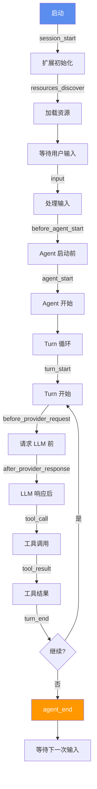

# Ch09 扩展系统架构

## 为什么需要扩展系统？

Pi 的核心只有 4 个工具和一个 Agent Loop。但用户的需求千差万别：
- 有人需要 MCP 集成
- 有人需要权限控制
- 有人需要自定义 UI
- 有人需要子 Agent

Pi 的答案是：**核心不内置这些功能，但提供一个强大的扩展系统，让你自己实现**。

## 运行前置条件

在开始本章之前，请确保满足以下条件：

1. **Node.js 18+**：原生支持 `fetch` API
2. **jiti**：用于加载 TypeScript 扩展（已包含在项目依赖中）

```bash
# 检查 Node.js 版本
node --version

# 安装 jiti（如果尚未安装）
npm install jiti
```

## 扩展的生命周期

Pi 的扩展通过**生命周期钩子**（Lifecycle Hooks）与 Agent 交互：



完整的事件列表：

> 注意：以下生命周期事件名称基于 Pi 架构的教学性描述，具体实现可能有差异。

| 事件 | 触发时机 | 能做什么 |
|------|---------|---------|
| `session_start` | 会话创建/恢复 | 初始化状态、加载配置 |
| `resources_discover` | 资源发现 | 注册额外的配置文件 |
| `input` | 用户输入 | 拦截/修改用户输入 |
| `before_agent_start` | Agent 启动前 | 注入额外上下文 |
| `agent_start` | Agent 开始 | 记录开始状态 |
| `turn_start` | 每轮开始 | 记录轮次 |
| `before_provider_request` | 请求 LLM 前 | 修改请求参数 |
| `after_provider_response` | LLM 响应后 | 修改响应内容 |
| `tool_call` | 工具调用 | 拦截/替换工具执行 |
| `tool_result` | 工具结果 | 修改工具结果 |
| `turn_end` | 每轮结束 | 记录轮次结果 |
| `message_end` | 消息结束 | 处理完整消息 |
| `agent_end` | Agent 结束 | 清理、记录 |
| `session_shutdown` | 会话关闭 | 持久化状态 |

## 实现扩展系统核心

```typescript
// extension-system.ts

type EventHandler = (event: any, ctx: ExtensionContext) => Promise<void>

interface ExtensionContext {
  cwd: string
  model: string
  ui: UIHelper
  signal: AbortSignal
  sessionManager: SessionManager
}

interface ExtensionAPI {
  on(event: string, handler: EventHandler): void
  registerTool(tool: ToolDefinition): void
  registerCommand(name: string, options: CommandOptions): void
  registerShortcut(key: string, options: ShortcutOptions): void
  sendMessage(message: Message, options?: SendMessageOptions): void
  setModel(model: string): void
  getActiveTools(): string[]
  setActiveTools(names: string[]): void
}

class ExtensionSystem {
  private handlers = new Map<string, EventHandler[]>()
  private tools = new Map<string, ToolDefinition>()
  private commands = new Map<string, CommandOptions>()

  // 创建扩展 API
  createAPI(): ExtensionAPI {
    return {
      on: (event, handler) => {
        if (!this.handlers.has(event)) {
          this.handlers.set(event, [])
        }
        this.handlers.get(event)!.push(handler)
      },
      registerTool: (tool) => {
        this.tools.set(tool.name, tool)
      },
      registerCommand: (name, options) => {
        this.commands.set(name, options)
      },
      // ... 其他方法
    }
  }

  // 触发事件
  async emit(event: string, data: any, ctx: ExtensionContext) {
    const handlers = this.handlers.get(event) || []
    for (const handler of handlers) {
      await handler(data, ctx)
    }
  }

  // 获取所有注册的工具
  getRegisteredTools(): ToolDefinition[] {
    return Array.from(this.tools.values())
  }
}
```

## 加载扩展

Pi 用 [jiti](https://github.com/unjs/jiti) 加载 TypeScript 扩展，无需编译：

```typescript
import { createJiti } from "jiti"
import { readdir } from "fs"
import path from "path"

async function loadExtensions(dir: string, api: ExtensionAPI) {
  const jiti = createJiti(dir)
  const files = await readdir(dir)
  
  for (const file of files) {
    if (!file.endsWith(".ts") && !file.endsWith(".js")) continue
    
    const ext = await jiti.import(path.join(dir, file))
    
    // 扩展导出一个默认函数，接收 ExtensionAPI
    if (typeof ext === "function") {
      await ext(api)
      console.log(`已加载扩展: ${file}`)
    }
  }
}
```

::: tip jiti 的魔力
jiti 是一个 JIT（即时）TypeScript/ESM 加载器。它能直接运行 TypeScript 文件，不需要你先 `tsc` 编译。这意味着你写完扩展文件，重启 Pi 就能用——零配置，零构建步骤。
:::

## 扩展示例：权限控制

让我们实现一个权限控制扩展——在执行危险命令前询问用户：

```typescript
// extensions/permission-gate.ts
export default function (pi: ExtensionAPI) {
  const DANGEROUS_PATTERNS = [
    /^rm\s/, /^sudo\s/, /^chmod\s/, /^chown\s/,
    /^git\s+push\s.*--force/, /^git\s+reset\s.*--hard/,
    /^drop\s+table/i, /^delete\s+from/i,
  ]

  pi.on("tool_call", async (event, ctx) => {
    if (event.tool !== "bash") return

    const command = event.args.command as string

    // 检查是否是危险命令
    const isDangerous = DANGEROUS_PATTERNS.some(pattern => pattern.test(command))

    if (isDangerous && ctx.ui) {
      const confirmed = await ctx.ui.confirm({
        message: `⚠️ 检测到危险命令：\n${command}\n\n确认执行？`,
        default: false,
      })

      if (!confirmed) {
        // 取消执行
        event.cancel = true
        event.result = "用户取消了该命令的执行"
      }
    }
  })
}
```

## 扩展示例：自定义状态栏

```typescript
// extensions/status-bar.ts
export default function (pi: ExtensionAPI) {
  let turnCount = 0
  let totalTokens = 0

  pi.on("turn_start", async (_event, ctx) => {
    turnCount++
  })

  pi.on("after_provider_response", async (event, ctx) => {
    totalTokens += event.usage?.input || 0
    totalTokens += event.usage?.output || 0
  })

  pi.on("agent_start", async (_event, ctx) => {
    if (ctx.ui) {
      ctx.ui.setStatus({
        left: `Turn: ${turnCount}`,
        right: `Tokens: ${totalTokens.toLocaleString()}`,
      })
    }
  })
}
```

## 扩展示例：日志记录

```typescript
// extensions/logger.ts
import { appendFileSync } from "fs"

export default function (pi: ExtensionAPI) {
  const logFile = ".pi/agent-log.jsonl"

  pi.on("agent_start", async (_event, ctx) => {
    appendFileSync(logFile, JSON.stringify({
      type: "agent_start",
      timestamp: Date.now(),
      model: ctx.model,
      cwd: ctx.cwd,
    }) + "\n")
  })

  pi.on("tool_call", async (event, ctx) => {
    appendFileSync(logFile, JSON.stringify({
      type: "tool_call",
      timestamp: Date.now(),
      tool: event.tool,
      args: event.args,
    }) + "\n")
  })

  pi.on("tool_result", async (event, ctx) => {
    appendFileSync(logFile, JSON.stringify({
      type: "tool_result",
      timestamp: Date.now(),
      tool: event.tool,
      resultLength: event.result?.length || 0,
    }) + "\n")
  })
}
```

## 扩展的目录结构

```
~/.pi/agent/extensions/          # 全局扩展
├── permission-gate.ts
├── status-bar.ts
└── logger.ts

.pi/extensions/                  # 项目级扩展
├── project-specific.ts
└── custom-tools.ts
```

::: tip 加载顺序
1. 全局扩展先加载
2. 项目级扩展后加载
3. 同名扩展，项目级覆盖全局
:::

## Pi 的 50+ 官方扩展示例

Pi 仓库中有 50 多个扩展示例，涵盖各种场景：

| 扩展 | 功能 |
|------|------|
| `plan-mode.ts` | 实现 Plan 模式（先规划再执行） |
| `todo.ts` | 实现 Todo 列表 |
| `sub-agent.ts` | 实现子 Agent |
| `path-protection.ts` | 保护指定路径不被修改 |
| `ssh-exec.ts` | 通过 SSH 远程执行命令 |
| `sandbox.ts` | 沙箱化执行 |
| `mcp-bridge.ts` | 桥接 MCP 服务器 |
| `custom-editor.ts` | 自定义编辑器 |
| `snake.ts` | 在终端玩贪吃蛇（演示 UI 能力） |

## 小练习

::: details 练习 1：实现自动 git 提交扩展
创建一个扩展：每次 Agent 修改文件后，自动 git add + commit。

::: details 参考思路
```typescript
export default function (pi: ExtensionAPI) {
  pi.on("tool_result", async (event, ctx) => {
    if (event.tool === "edit" || event.tool === "write") {
      const { execSync } = await import("child_process")
      try {
        execSync(`git add -A && git commit -m "agent: update ${event.args.path}"`, {
          cwd: ctx.cwd,
        })
      } catch {
        // git 操作失败不阻塞
      }
    }
  })
}
```
:::
:::

::: details 练习 2：实现 token 用量统计扩展
创建一个扩展：统计每次 LLM 调用的 token 用量，在 Agent 结束时显示汇总。

::: details 提示
监听 `after_provider_response` 事件获取每次的 token 用量，在 `agent_end` 事件中显示汇总。
:::
:::

## 下一章

扩展系统让我们能添加任意功能。下一章，我们将学习 Skill 系统——如何通过 Markdown 文件给 Agent 添加按需加载的能力。
