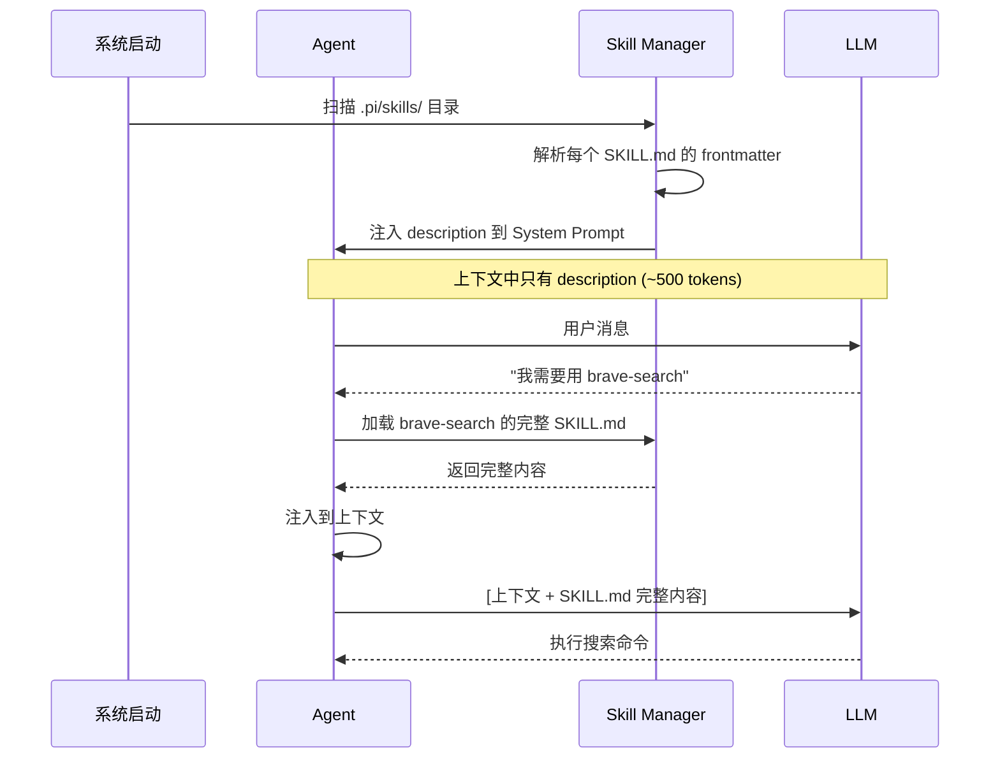

# Ch10 Skill 系统

## Skill 是什么？

Skill 是 Pi 的**按需能力加载**机制。它解决了一个核心矛盾：你想给 Agent 很多能力，但每次调用 LLM 都要发送所有工具定义和指令，这会浪费大量 token。

Skill 的解决方案：**只在 System Prompt 里放描述，详细指令按需加载**。

## Skill 的结构

一个 Skill 就是一个目录，里面有一个 `SKILL.md` 文件：

```
.pi/skills/
├── brave-search/
│   ├── SKILL.md          # Skill 定义
│   ├── search.ts         # 可选：可执行脚本
│   └── package.json      # 可选：依赖
├── pdf-tools/
│   └── SKILL.md
└── browser/
    ├── SKILL.md
    └── browser.ts
```

SKILL.md 的格式：

```markdown
---
name: brave-search
description: 通过 Brave Search API 搜索网页。用于查找文档、搜索技术问题、获取最新信息。
---

# Brave Search

## 安装
```bash
cd .pi/skills/brave-search && npm install
```

## 搜索
```bash
export BRAVE_API_KEY=your_key
node .pi/skills/brave-search/search.js "搜索内容"
```

## 注意事项
- 每次搜索消耗 1 个 API 额度
- 结果限制为前 10 条
- 搜索结果包含标题、URL 和摘要
```

::: tip 关键设计
`description` 字段极其重要——它是 Agent 决定是否加载这个 Skill 的唯一依据。写得太模糊（"搜索工具"）会导致误触发，写得太具体会导致漏触发。
:::

## Skill 的生命周期



## 实现 Skill Manager

```typescript
// skill-manager.ts
import { readFileSync, readdirSync, existsSync } from "fs"
import { join } from "path"

interface SkillMeta {
  name: string
  description: string
  path: string
}

interface Skill extends SkillMeta {
  content: string  // SKILL.md 的完整内容
}

class SkillManager {
  private skills: SkillMeta[] = []
  private loadedSkills: Map<string, Skill> = new Map()
  private skillDirs: string[]

  constructor(skillDirs: string[]) {
    this.skillDirs = skillDirs
    this.discover()
  }

  // 扫描所有 Skill 目录
  private discover() {
    for (const dir of this.skillDirs) {
      if (!existsSync(dir)) continue

      const entries = readdirSync(dir, { withFileTypes: true })
      for (const entry of entries) {
        if (!entry.isDirectory()) continue

        const skillMdPath = join(dir, entry.name, "SKILL.md")
        if (!existsSync(skillMdPath)) continue

        const content = readFileSync(skillMdPath, "utf-8")
        const meta = this.parseFrontmatter(content, join(dir, entry.name))
        if (meta) {
          this.skills.push(meta)
        }
      }
    }

    console.log(`发现 ${this.skills.length} 个 Skill`)
  }

  // 解析 SKILL.md 的 frontmatter
  private parseFrontmatter(content: string, skillPath: string): SkillMeta | null {
    const match = content.match(/^---\n([\s\S]*?)\n---/)
    if (!match) return null

    const frontmatter = match[1]
    const nameMatch = frontmatter.match(/name:\s*(.+)/)
    const descMatch = frontmatter.match(/description:\s*(.+)/)

    if (!nameMatch || !descMatch) return null

    return {
      name: nameMatch[1].trim(),
      description: descMatch[1].trim(),
      path: skillPath,
    }
  }

  // 获取所有 Skill 的描述（用于 System Prompt）
  getDescriptions(): string {
    return this.skills
      .map(s => `- ${s.name}: ${s.description}`)
      .join("\n")
  }

  // 按需加载 Skill 的完整内容
  load(name: string): Skill | null {
    if (this.loadedSkills.has(name)) {
      return this.loadedSkills.get(name)!
    }

    const meta = this.skills.find(s => s.name === name)
    if (!meta) return null

    const content = readFileSync(join(meta.path, "SKILL.md"), "utf-8")
    const skill: Skill = { ...meta, content }
    this.loadedSkills.set(name, skill)
    return skill
  }

  // 根据用户消息判断需要哪些 Skill
  detectNeeded(userMessage: string): string[] {
    const needed: string[] = []
    const lowerMessage = userMessage.toLowerCase()

    for (const skill of this.skills) {
      // 简单的关键词匹配（实际产品中可以用更智能的方式）
      const keywords = skill.description.toLowerCase().split(/[,、，]/)
      const matches = keywords.some(kw => lowerMessage.includes(kw.trim()))
      if (matches) {
        needed.push(skill.name)
      }
    }

    return needed
  }
}
```

## 集成到 Agent Loop

```typescript
class AgentLoop {
  private skillManager: SkillManager

  async run(userMessage: string): Promise<string> {
    // 检测需要的 Skill
    const neededSkills = this.skillManager.detectNeeded(userMessage)
    
    // 加载需要的 Skill
    for (const skillName of neededSkills) {
      const skill = this.skillManager.load(skillName)
      if (skill) {
        // 注入到上下文
        this.messages.push({
          role: "system",
          content: `[Skill: ${skill.name}]\n${skill.content}`,
        })
      }
    }

    // 正常的 Agent Loop...
  }
}
```

## Skill 的描述设计

Skill 的 description 是 Agent 决策的依据。好的 description 应该：

| 好的 description | 差的 description |
|-----------------|-----------------|
| "通过 Brave Search API 搜索网页。用于查找文档、搜索技术问题、获取最新信息。" | "搜索工具" |
| "处理 PDF 文件：提取文本内容、填写 PDF 表单、合并多个 PDF、拆分 PDF 页面。" | "PDF 相关功能" |
| "自动化浏览器操作：打开网页、截图、点击元素、填写表单、等待加载。" | "浏览器工具" |

::: warning description 的陷阱
- **太模糊**：Agent 会在不需要时也触发（误报）
- **太具体**：Agent 在需要时反而不触发（漏报）
- **太长**：浪费 System Prompt 的 token 预算
- **太短**：信息不够 Agent 判断
:::

## Skill 和扩展的区别

| 方面 | Skill | 扩展 |
|------|-------|------|
| 格式 | Markdown + 可选脚本 | TypeScript 代码 |
| 加载时机 | 按需（运行时） | 启动时 |
| 能力 | 提供指令和脚本 | 注册工具、钩子、命令 |
| 复杂度 | 低（写 Markdown） | 高（写代码） |
| 适合场景 | 给 Agent 提供操作指南 | 给 Agent 添加新能力 |

::: tip 实际案例
- **Skill**：告诉 Agent "如何用 ffmpeg 转换视频格式"
- **扩展**：给 Agent 添加一个 `ffmpeg` 工具，直接调用 ffmpeg API
:::

## agentskills.io 标准

Pi 的 Skill 遵循 [agentskills.io](https://agentskills.io) 标准。这意味着你写的 Skill 可以在不同的 Agent 工具之间共享。

标准格式：

```markdown
---
name: my-skill
description: 一句话描述
version: 1.0.0
author: your-name
tags: [search, web, api]
---

# Skill 名称

## 使用场景
什么时候应该使用这个 Skill

## 操作步骤
1. 第一步
2. 第二步

## 注意事项
- 限制和注意事项
```

## 小练习

::: details 练习 1：创建一个 Git Skill
创建一个 Git Skill，教 Agent 如何使用 Git 进行版本控制。

::: details 参考
```markdown
---
name: git-ops
description: Git 版本控制操作：提交代码、创建分支、合并冲突、查看历史。
---

# Git 操作

## 提交代码
```bash
git add -A
git commit -m "描述性的提交信息"
```

## 创建分支
```bash
git checkout -b feature/新功能名
```

## 查看差异
```bash
git diff           # 工作区差异
git diff --cached  # 暂存区差异
git log --oneline  # 提交历史
```

## 合并冲突
1. `git merge branch-name`
2. 打开冲突文件，找到 <<<<<<< 标记
3. 手动解决冲突
4. `git add .` + `git commit`
```
:::
:::

::: details 练习 2：实现智能 Skill 匹配
改进 `detectNeeded` 方法，用 LLM 来判断需要哪些 Skill，而不是简单的关键词匹配。

::: details 提示
```typescript
async detectNeededWithLLM(userMessage: string): Promise<string[]> {
  const response = await this.provider.chat({
    model: this.model,
    messages: [{
      role: "user",
      content: `根据用户消息，判断需要加载哪些 Skill。只返回 Skill 名称列表，用逗号分隔。如果不需要任何 Skill，返回 "none"。

可用 Skill：
${this.getDescriptions()}

用户消息：${userMessage}`
    }],
  })
  
  if (response.content === "none") return []
  return response.content.split(",").map(s => s.trim())
}
```
:::
:::

## 下一章

Skill 系统让 Agent 的能力可以按需扩展。下一章，我们将简要介绍 Pi 的 TUI（终端 UI）设计——了解一个真正的终端 Agent 是如何处理用户交互的。
