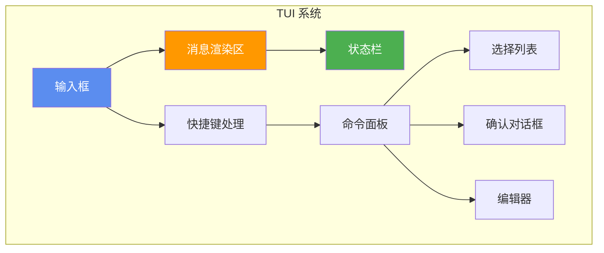
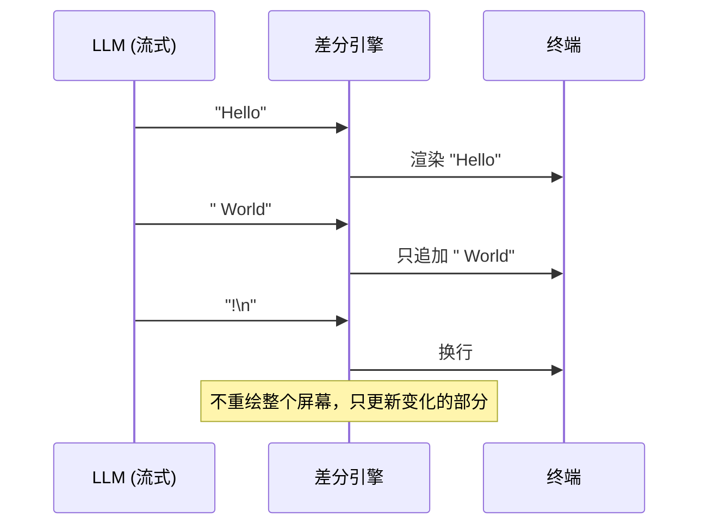

# Ch11 TUI 与交互设计

## 为什么需要 TUI？

一个终端 Agent 不仅仅是"调用 LLM + 执行工具"。用户需要：
- 实时看到 Agent 的输出（流式显示）
- 在 Agent 运行时插入引导消息
- 看到当前状态（正在执行什么工具）
- 选择模型、切换 Provider
- 查看和管理会话历史

Pi 用一个自定义的 TUI（Terminal UI）库来处理这些交互。

## 运行前置条件

在开始本章之前，请确保满足以下条件：

1. **Node.js 18+**：原生支持 `fetch` API
2. **OpenAI API Key**：本章示例使用 OpenAI 的 API 进行交互
3. **环境变量**：设置 `OPENAI_API_KEY`

```bash
# 检查 Node.js 版本
node --version

# 设置 API Key
export OPENAI_API_KEY=sk-xxx
```

## TUI 的核心组件



| 组件 | 职责 |
|------|------|
| **输入框** | 接收用户输入，支持多行编辑 |
| **消息渲染区** | 显示对话历史，支持 Markdown 渲染 |
| **状态栏** | 显示当前模型、token 用量、轮次 |
| **命令面板** | `/model`、`/tree`、`/fork` 等斜杠命令 |
| **选择列表** | 模型选择、会话选择、分支选择 |
| **确认对话框** | 危险操作确认 |

## 差分渲染

Pi 的 TUI 使用**差分渲染**（Differential Rendering）来避免闪烁：



::: tip 为什么不用 React？
你可能会问：为什么不用 React 或 Ink（React for CLI）来做 TUI？

Pi 的答案：
1. **性能**：差分渲染比 React 的虚拟 DOM 快得多
2. **控制**：直接控制终端输出，避免框架的抽象层开销
3. **闪烁**：React 的重绘机制在终端环境下容易闪烁
4. **IME 支持**：中文、日文等输入法需要底层处理
:::

## 实现简化的 TUI

我们实现一个简化版的 TUI，支持基本的输入/输出：

```typescript
// tui.ts
import * as readline from "readline"

interface TUIOptions {
  prompt?: string
  onInput: (input: string) => void
  onCommand: (command: string, args: string) => void
}

class SimpleTUI {
  private rl: readline.Interface
  private isStreaming = false

  constructor(private options: TUIOptions) {
    this.rl = readline.createInterface({
      input: process.stdin,
      output: process.stdout,
    })
  }

  start() {
    this.showWelcome()
    this.prompt()
  }

  private showWelcome() {
    console.log("\n🤖 Pi Agent 教学版")
    console.log("输入消息开始对话，输入 /help 查看命令\n")
  }

  private prompt() {
    this.rl.question("You: ", (input) => {
      const trimmed = input.trim()
      if (!trimmed) return this.prompt()

      // 处理斜杠命令
      if (trimmed.startsWith("/")) {
        const [command, ...rest] = trimmed.slice(1).split(" ")
        this.options.onCommand(command, rest.join(" "))
        return this.prompt()
      }

      this.options.onInput(trimmed)
    })
  }

  // 流式输出 Agent 的响应
  writeStream(text: string) {
    if (!this.isStreaming) {
      process.stdout.write("\nAgent: ")
      this.isStreaming = true
    }
    process.stdout.write(text)
  }

  endStream() {
    if (this.isStreaming) {
      process.stdout.write("\n\n")
      this.isStreaming = false
    }
  }

  // 显示工具调用
  showToolCall(tool: string, args: string) {
    console.log(`\n  🔧 调用工具: ${tool}`)
    console.log(`     参数: ${args.slice(0, 100)}${args.length > 100 ? "..." : ""}`)
  }

  showToolResult(result: string) {
    const preview = result.slice(0, 200)
    console.log(`     结果: ${preview}${result.length > 200 ? "..." : ""}`)
  }

  // 显示状态
  setStatus(left: string, right: string) {
    // 使用 ANSI 转义码在终端底部显示状态
    const width = process.stdout.columns || 80
    const padding = width - left.length - right.length
    const statusLine = left + " ".repeat(Math.max(1, padding)) + right
    process.stdout.write(`\x1b[2K\r\x1b[90m${statusLine}\x1b[0m\n`)
  }

  close() {
    this.rl.close()
  }
}
```

## 使用 TUI

```typescript
const tui = new SimpleTUI({
  onInput: async (input) => {
    // 用户输入，启动 Agent Loop
    await agent.run(input)
    tui.endStream()
    tui.prompt()
  },
  onCommand: (command, args) => {
    switch (command) {
      case "help":
        console.log("可用命令: /help, /model, /clear, /quit")
        break
      case "model":
        agent.setModel(args)
        console.log(`已切换到模型: ${args}`)
        break
      case "clear":
        agent.clearHistory()
        console.log("已清空对话历史")
        break
      case "quit":
        process.exit(0)
    }
  },
})

tui.start()
```

## 集成 Agent Loop 和 TUI

```typescript
// 完整的交互式 Agent
class InteractiveAgent {
  private agentLoop: AgentLoop
  private tui: SimpleTUI

  constructor() {
    this.agentLoop = new AgentLoop(/* ... */)
    this.tui = new SimpleTUI({
      onInput: this.handleInput.bind(this),
      onCommand: this.handleCommand.bind(this),
    })

    // 监听 Agent 事件
    this.agentLoop.on("text", (text) => this.tui.writeStream(text))
    this.agentLoop.on("tool_call", (event) => this.tui.showToolCall(event.tool, event.args))
    this.agentLoop.on("tool_result", (result) => this.tui.showToolResult(result))
  }

  async handleInput(input: string) {
    try {
      await this.agentLoop.run(input)
    } catch (err) {
      console.error(`\n❌ 错误: ${err.message}`)
    }
    this.tui.endStream()
    this.tui.prompt()
  }

  handleCommand(command: string, args: string) {
    // 命令处理...
  }

  start() {
    this.tui.start()
  }
}
```

## ANSI 转义码

终端的样式和控制通过 ANSI 转义码实现：

```typescript
// 常用 ANSI 转义码
const ANSI = {
  reset: "\x1b[0m",
  bold: "\x1b[1m",
  dim: "\x1b[2m",
  italic: "\x1b[3m",
  
  // 前景色
  red: "\x1b[31m",
  green: "\x1b[32m",
  yellow: "\x1b[33m",
  blue: "\x1b[34m",
  gray: "\x1b[90m",
  
  // 光标控制
  clearLine: "\x1b[2K",
  cursorUp: "\x1b[A",
  cursorDown: "\x1b[B",
  
  // 清屏
  clearScreen: "\x1b[2J\x1b[H",
}

// 使用示例
console.log(`${ANSI.bold}${ANSI.blue}Agent:${ANSI.reset} 这是加粗蓝色的文字`)
console.log(`${ANSI.green}✅ 成功${ANSI.reset}`)
console.log(`${ANSI.red}❌ 失败${ANSI.reset}`)
console.log(`${ANSI.gray}[Turn 3]${ANSI.reset}`)
```

::: tip Pi 的 TUI 库
Pi 有自己的 TUI 库 `@earendil-works/pi-tui`，提供了：
- 组件系统（SelectList、SettingsList、BorderedLoader 等）
- 焦点管理
- IME 支持（中文输入法）
- Overlay 系统（弹窗、对话框）
- 主题系统（51 个颜色 token）

教学版我们用简单的 ANSI 转义码，理解原理即可。
:::

## 4 种运行模式

Pi 支持 4 种运行模式，TUI 只是其中之一：

| 模式 | 命令 | 有 TUI? | 适合场景 |
|------|------|---------|---------|
| 交互式 | `pi` | ✅ | 日常使用 |
| 单次输出 | `pi -p "问题"` | ❌ | 脚本集成 |
| RPC | `pi --rpc` | ❌ | IDE 集成 |
| SDK | `import { createAgentSession }` | ❌ | 嵌入应用 |

```bash
# 交互式
pi

# 单次输出（适合脚本）
pi -p "列出所有 TypeScript 文件"

# 管道模式
cat README.md | pi -p "总结这段文字"

# 指定模型
pi --model gpt-4o -p "用中文回答：什么是递归？"
```

## 小练习

::: details 练习 1：添加进度指示器
为 TUI 添加一个"思考中..."的动画指示器，在等待 LLM 响应时显示。

::: details 参考思路
```typescript
class ProgressIndicator {
  private frames = ["⠋", "⠙", "⠹", "⠸", "⠼", "⠴", "⠦", "⠧", "⠇", "⠏"]
  private interval: NodeJS.Timeout | null = null
  private frameIndex = 0

  start(message: string) {
    this.interval = setInterval(() => {
      process.stdout.write(`\r${this.frames[this.frameIndex]} ${message}`)
      this.frameIndex = (this.frameIndex + 1) % this.frames.length
    }, 80)
  }

  stop() {
    if (this.interval) {
      clearInterval(this.interval)
      this.interval = null
      process.stdout.write("\r\x1b[2K")  // 清除行
    }
  }
}
```
:::
:::

::: details 练习 2：实现会话选择 UI
实现一个 `/sessions` 命令，列出最近的会话文件，让用户选择恢复哪个会话。

::: details 提示
用 `readdirSync` 读取会话目录，按修改时间排序，用简单的编号选择。
:::
:::

## 下一章

TUI 是 Agent 的"脸面"。下一章，我们将把前面所有模块组装起来，构建一个完整的 Mini Agent 项目。
