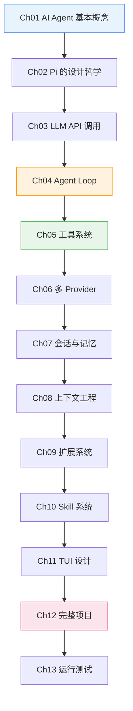

# Ch14 总结与扩展方向

## 我们学到了什么？

回顾整个教程，我们从零开始构建了一个 AI Agent，理解了以下核心概念：



### 核心收获

| 章节 | 核心收获 |
|------|---------|
| Ch01 | Agent = LLM + 工具 + 循环 |
| Ch02 | "原语优先，不要过度抽象" |
| Ch03 | 统一 API 层支持多 Provider |
| Ch04 | Agent Loop 是 while(true) + tool_calls 判断 |
| Ch05 | 4 个工具覆盖所有场景，bash 是万能胶水 |
| Ch06 | Provider 适配器模式 + 自动解析模型 |
| Ch07 | JSONL 树状会话 + LLM 自总结压缩 |
| Ch08 | 上下文工程决定 Agent 质量 |
| Ch09 | 生命周期钩子实现可插拔架构 |
| Ch10 | Skill 按需加载，渐进式披露 |
| Ch11 | TUI 差分渲染，避免闪烁 |
| Ch12 | 模块化组装，事件驱动连接 |
| Ch13 | 调试技巧和性能优化 |

## Pi 的设计哲学总结

::: tip 三条核心原则
1. **Primitives, not features** —— 给原语，不给功能
2. **Context engineering** —— 上下文质量决定 Agent 质量
3. **Extension over inclusion** —— 扩展优于内置
:::

### 为什么"少即是多"？

```
工具定义少 → token 省 → 成本低 → 上下文空间大
抽象层少 → 代码简单 → 出 bug 少 → 容易理解
内置功能少 → 扩展空间大 → 用户自定义强
```

## 扩展方向

完成本教程后，你可以继续探索以下方向：

### 1. 添加更多 Provider

- Google Gemini
- DeepSeek
- 本地模型（Ollama、vLLM）

### 2. 实现子 Agent

```typescript
// 子 Agent 可以并行处理任务
const subAgent = new AgentLoop({
  provider: mainAgent.provider,
  model: "gpt-4o-mini",  // 子 Agent 用更便宜的模型
  tools: subsetOf(mainAgent.tools, ["read", "bash"]),
})

// 主 Agent 可以委托任务给子 Agent
registerTool({
  name: "delegate",
  description: "将任务委托给子 Agent",
  execute: async (args) => {
    return await subAgent.run(args.task)
  },
})
```

### 3. 实现 MCP 桥接

```typescript
// 将 MCP 服务器包装为 CLI 工具
// Pi 的理念：CLI 工具 + README > MCP 服务器
const mcpBridge = {
  name: "mcp_bridge",
  description: "调用 MCP 服务器提供的工具",
  execute: async (args) => {
    // 通过 CLI 调用 MCP 工具
    const result = execSync(`mcp-client call ${args.tool} '${JSON.stringify(args.params)}'`)
    return result
  },
}
```

### 4. 添加安全沙箱

```typescript
// 在 Docker 容器中执行 bash 命令
const sandboxedBash = {
  name: "bash",
  execute: async (args) => {
    let containerId: string | null = null
    try {
      containerId = execSync(`docker run -d -v $(pwd):/workspace node:18 tail -f /dev/null`).toString().trim()
      const result = execSync(`docker exec ${containerId} bash -c "${args.command}"`)
      return result
    } finally {
      if (containerId) {
        execSync(`docker rm -f ${containerId}`)
      }
    }
  },
}
```

### 5. 实现 RAG（检索增强生成）

```typescript
// 向量数据库集成
const ragTool = {
  name: "search_docs",
  description: "搜索项目文档",
  execute: async (args) => {
    const embeddings = await embed(args.query)
    const results = await vectorDB.search(embeddings, { topK: 5 })
    return results.map(r => r.content).join("\n---\n")
  },
}
```

### 6. 添加 Web UI

用 React 构建一个 Web 界面，通过 RPC 协议与 Agent 通信：

```typescript
// Web UI 通过 WebSocket 连接 Agent
const ws = new WebSocket("ws://localhost:3000")
ws.send(JSON.stringify({ type: "prompt", text: "帮我重构这个函数" }))

ws.onmessage = (event) => {
  const data = JSON.parse(event.data)
  if (data.type === "text") {
    appendToChat(data.content)
  }
}
```

## 推荐阅读

### 博客文章

- [What I learned building an opinionated and minimal coding agent](https://mariozechner.at/posts/2025-11-30-pi-coding-agent/) —— Pi 创始人 Mario Zechner 的技术深度分享
- [What if you don't need MCP at all?](https://mariozechner.at/posts/2025-11-02-what-if-you-dont-need-mcp/) —— MCP vs CLI 的思考
- [Agent Design Is Still Hard](https://lucumr.pocoo.org/2025/11/21/agents-are-hard/) —— Armin Ronacher 的 Agent 设计经验

### 开源项目

- [Pi 源码](https://github.com/earendil-works/pi) —— 学习真实的 Agent 实现
- [Pi 扩展示例](https://github.com/earendil-works/pi/tree/main/packages/coding-agent/examples) —— 50+ 扩展示例
- [Pi Skills](https://github.com/badlogic/pi-skills) —— Skill 示例集合
- [Anthropic Skills](https://github.com/anthropics/skills) —— 官方 Skill 示例

### 相关框架

- [Claude Code](https://claude.ai/code) —— Anthropic 的编码 Agent
- [OpenAI Codex](https://openai.com/index/codex/) —— OpenAI 的编码 Agent
- [LangChain](https://langchain.com) —— Agent 编程框架

## 最后的话

::: warning 重要提醒
本教程的 Mini Agent 是**教学版本**，省略了很多工程细节：
- 没有完整的错误恢复
- 没有安全沙箱
- 没有性能优化
- 没有测试覆盖

不要在生产环境中使用。但它的核心思想和 Pi 是一致的。
:::

::: tip 学习建议
1. **先跑通 Demo**：确保每个 Demo 都能运行
2. **理解原理**：不只是抄代码，要理解为什么这么设计
3. **动手改进**：尝试添加新功能，比如子 Agent 或 RAG
4. **读 Pi 源码**：对照教学版，看 Pi 是怎么处理细节的
5. **构建自己的 Agent**：用学到的知识，构建一个满足你需求的 Agent
:::

## 常见问题

### Q: 我应该直接用 Pi 还是自己构建？

**A:** 如果你想要一个开箱即用的编码 Agent，直接用 Pi。如果你想理解 Agent 的内部原理，或者需要高度定制化的 Agent，自己构建。本教程的知识可以帮助你更好地使用 Pi，也可以帮你构建自己的 Agent。

### Q: 和 LangChain 相比，Pi 的方式有什么优势？

**A:** Pi 的方式更轻量、更透明。LangChain 抽象了很多细节，但也隐藏了很多实现。Pi 的"原语优先"理念让你能完全控制 Agent 的行为。

### Q: 我需要多少 LLM API 费用？

**A:** 教学版 Mini Agent 每次对话大约消耗 0.01-0.1 美元（取决于模型和对话长度）。Pi 的方式更省，因为工具定义更少，上下文空间利用更高效。

### Q: 如何让 Agent 更安全？

**A:** 
1. 使用沙箱（Docker/VM）执行 bash 命令
2. 添加权限控制扩展
3. 使用 git 做版本控制和回滚
4. 限制工具的访问范围

## 感谢

感谢你完成这个教程！希望你对 AI Agent 的原理有了深入的理解。如果有什么问题或建议，欢迎在 GitHub 上提 issue。

**Happy hacking! 🚀**
