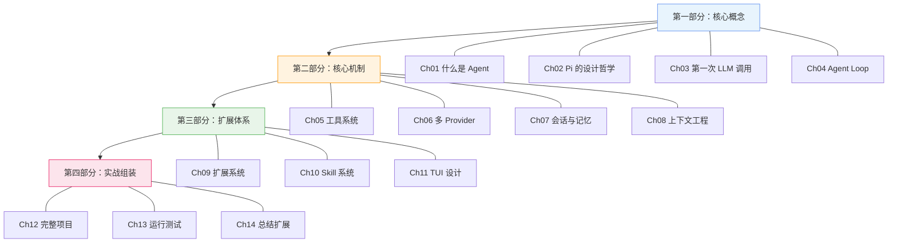

# 教程简介

## 这个教程是什么？

这是一个关于 **AI Agent 原理与实现** 的渐进式教程。我们以 [Pi](https://pi.dev) —— 一个 56k+ Star（截至 2026 年 5 月）的极简终端编码 Agent —— 为蓝本，从零开始拆解它的核心原理，最终带你亲手实现一个保留核心思想的教学版 Mini Agent。

::: tip 为什么选 Pi？
Pi 的核心代码量小、设计哲学清晰（"primitives, not features"），是学习 Agent 架构的绝佳素材。它不像 LangChain 那样庞大复杂，也不像学术论文那样抽象——它是一个**真正能用的工程产品**，同时又足够精简，适合作为教学案例。
:::

## 你将学到什么？

完成本教程后，你将理解并能亲手实现以下内容：

| 能力 | 具体内容 |
|------|---------|
| Agent 核心循环 | ReAct 模式、推理-行动-观察循环、何时停止 |
| 工具系统 | read / write / edit / bash 四工具设计、参数校验、结果处理 |
| 多 Provider 抽象 | 统一 API 层、流式响应、中途中断模型切换 |
| 会话管理 | JSONL 存储、树状分支、上下文压缩（Compaction） |
| 上下文工程 | System Prompt 设计、AGENTS.md 层级加载、Skill 按需加载 |
| 扩展系统 | 生命周期钩子、事件订阅、自定义工具注册 |
| 完整项目 | 一个可运行的 Mini Agent，具备工具调用、多 Provider、会话持久化 |

## 适合谁？

- 计算机本科及以上学历，有 TypeScript/JavaScript 基础
- 想理解 AI Agent 内部工作原理的开发者
- 想构建自己 Agent 产品的工程师
- 对 Pi 的设计哲学感兴趣的技术人员

## 教程结构

## 技术栈

| 层 | 技术 | 说明 |
|----|------|------|
| 前端 | React + TypeScript | Demo 演示界面 |
| 后端 | Node.js + TypeScript | Agent 运行时 |
| 构建 | Vite + tsx | 开发与运行 |
| 文档 | VitePress | 你正在看的这个站点 |
| LLM | OpenAI / Anthropic / Google API | 多 Provider 支持 |

## 如何使用本教程

1. **按顺序阅读**：章节之间有递进关系，建议从 Ch01 开始
2. **跑通每个 Demo**：每章都配有可运行的代码，`cd demos/demo-xx && npm install && npm run dev`
3. **做练习**：每章末尾有小练习，动手做比看十遍更有效
4. **看源码对比**：最终项目和 Pi 的真实源码做对比，理解简化了什么、保留了什么

## 约定

- 📁 目录树用代码块展示
- 💡 重要概念用 Tip 框标注
- ⚠️ 常见错误用 Warning 框标注
- 🔗 外部链接指向 Pi 官方文档或源码
- 代码示例均可直接运行，省略了 `import` 中的类型导入（如 `import type { ... }`）

让我们从第一个问题开始：**什么是 AI Agent？**
